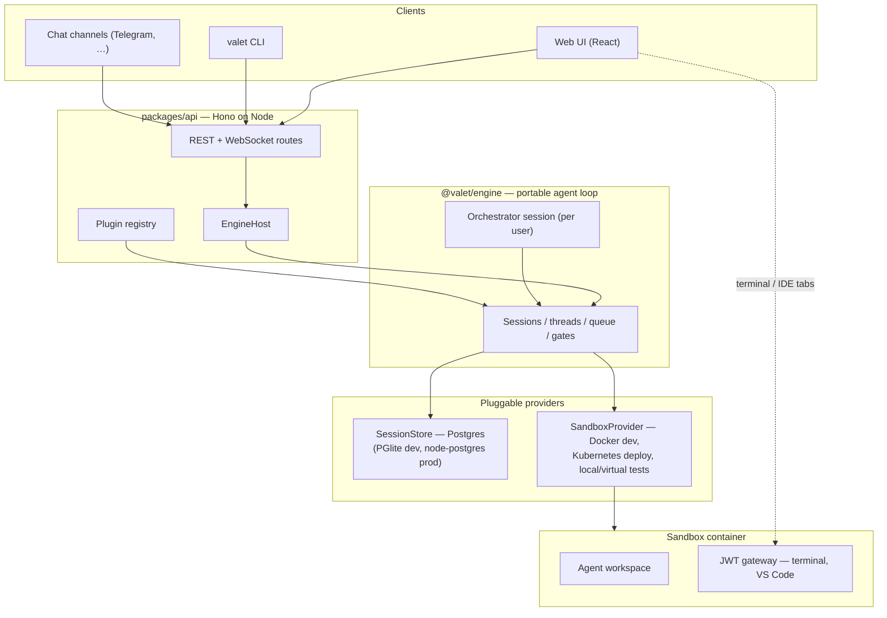

# Valet

**Self-hosted background coding agents with full dev environments.**

Give your AI coding agent its own sandbox — complete with VS Code, a terminal, and a real workspace — and let it work in the background while you do something else. Watch it think, intervene when needed, or check back when it's done.

<p align="center">
  
</p>

## Features

- **Isolated sandboxes** — Every session gets its own container with a full dev environment. No local machine risk, no shared state between tasks.
- **Full dev environment** — VS Code and a terminal accessible directly in the web UI, served through an in-sandbox auth gateway. The agent has the same tools a human developer would.
- **Watch or walk away** — Stream the agent's work in real time over WebSocket, or let it run in the background. Thread history is persisted; pick up where it left off anytime.
- **Orchestrator sessions** — A per-user orchestrator (itself a full agent session) spawns and manages child sessions, routes chat channels, and keeps memory across tasks.
- **Chat channels** — Talk to your agents from outside the web UI. Telegram is supported today; channels are pluggable.
- **Plugin integrations** — GitHub, Slack, Linear, Notion, Gmail, Google Calendar/Drive/Sheets, Stripe, Sentry, Cloudflare, and more — each a self-describing plugin package.
- **CLI included** — `valet` is a single self-contained binary that is both the server (`valet serve`) and its client (`valet sessions`, `valet send`, `valet chat`, …). See [docs/cli.md](docs/cli.md).
- **Self-hosted** — Run it on your own machine with Docker, or deploy to Kubernetes with the bundled Helm chart. Your code and API keys stay on your infrastructure.

## Quick Start

### Prerequisites

- [Node.js](https://nodejs.org/) 22+ and [pnpm](https://pnpm.io/)
- [Docker](https://www.docker.com/) (session sandboxes in local dev)
- An Anthropic API key

### Run locally

```bash
pnpm install

ANTHROPIC_API_KEY=sk-ant-... make dev-local
# API on :8788, web UI on :5173 — open http://localhost:5173
```

By default dev runs with a stubbed local user (`VALET_LOCAL_AUTH=1`) and an embedded Postgres (PGlite, data in `~/.valet/pg`) — no database or auth setup required. Setting `BETTER_AUTH_SECRET` enables real auth (email/password, optional OIDC/social).

### Validate changes

```bash
make e2e                          # unified e2e scorecard — runs every suite your creds/daemons allow
make e2e E2E_ARGS="--doctor"      # environment readiness checklist
pnpm typecheck                    # TypeScript across all packages
pnpm test                         # root vitest sweep
```

### Deploy (Kubernetes)

The Helm chart in `deploy/` runs the API, a bundled Postgres, and sandboxes as [agent-sandbox](https://github.com/kubernetes-sigs/agent-sandbox) CRs. The full runbook (local reference environment on Rancher Desktop) is [`deploy/README.md`](deploy/README.md); architecture and constraints are in [docs/kubernetes.md](docs/kubernetes.md).

```bash
make k8s-sandbox-install   # install the sandbox CRD/controller (run first, idempotent)
make k8s-build             # build valet-api:dev + valet-sandbox:dev images
make k8s-up                # helm upgrade --install
```

## Architecture



**How a session works:** You send a message through the web UI, CLI, or a chat channel. The API hands it to `@valet/engine`, which runs the agent loop (over pi-agent-core) inside the session's sandbox, persists every entry to Postgres, and streams events back over WebSocket. REST is authoritative for thread history, so reconnecting — or coming back hours later — always shows the full record.

## Packages

| Package | Description |
|---------|-------------|
| `packages/api` | Node API (Hono) — routes, engine hosting, auth, plugin registry, the `valet` CLI |
| `packages/web` | Web client — Vite, React 19, TanStack Router/Query, Tailwind, Radix |
| `packages/engine` | `@valet/engine` — portable agent loop, sessions, threads, gates, persistence contracts |
| `packages/store-postgres` | `SessionStore` over Postgres (PGlite in dev/test, node-postgres in prod) |
| `packages/sandbox-docker` | Sandbox provider over Docker (local dev default) |
| `packages/sandbox-kubernetes` | Sandbox provider over agent-sandbox CRs (Helm deploy) |
| `packages/sandbox-local` | Sandbox provider over the host fs/process (tests) |
| `packages/sandbox-gateway` | In-sandbox JWT gateway serving the terminal and VS Code tabs |
| `packages/workflow` | Workflow DAG interpreter (nodes, expressions, checkpoints) |
| `packages/sdk` | Integration & channel contracts, MCP client, shared UI components |
| `packages/shared` | Shared TypeScript types and error classes |
| `packages/plugin-*` | One package per integration/skill — GitHub, Slack, Telegram, Linear, Notion, … |
| `deploy/` | Helm chart + vendored agent-sandbox controller |
| `docker/` | Sandbox container images |

A few legacy packages (`packages/worker`, `packages/client`, `packages/runner`, `backend/`) remain from the original Cloudflare + Modal stack. They are frozen — kept only for the existing production deploy — and are slated for deletion. Don't build on them.

## Development

```bash
make dev-local            # API (:8788) + web (:5173) — the v2 dev loop

# Quick smokes (also rows in make e2e)
make smoke-orchestrator   # fastest agent-loop-alive check (real Anthropic, no Docker)
make smoke-session        # full session round-trip (real Anthropic + Docker)

# Code quality
pnpm typecheck            # all packages (legacy worker excluded)
pnpm test                 # root vitest sweep

# Code generation
make generate-registries  # regenerate the plugin registry from plugin.yaml manifests

# Kubernetes (local k3s / Rancher Desktop)
make k8s-build && make k8s-up
make k8s-logs             # tail the api pod
make k8s-down
```

## Documentation

- **[The `valet` CLI](docs/cli.md)** — serve, sessions, send, chat, gates, instance profiles
- **[Kubernetes architecture](docs/kubernetes.md)** — what gets deployed and the constraints to respect
- **[Deploy runbook](deploy/README.md)** — the local reference environment, step by step
- **[Subsystem specs](docs/specs/)** — source of truth per domain; dated `YYYY-MM-DD-*-design.md` files describe the current (v2) stack
- **[Security model](docs/security-model.md)** — sandbox isolation and credential handling

## Contributing

Contributions are welcome. Please open an issue to discuss larger changes before submitting a PR.

```bash
pnpm install              # install dependencies
make dev-local            # start the dev stack
pnpm typecheck            # verify your changes compile
make e2e                  # run the e2e scorecard
```

## License

MIT
