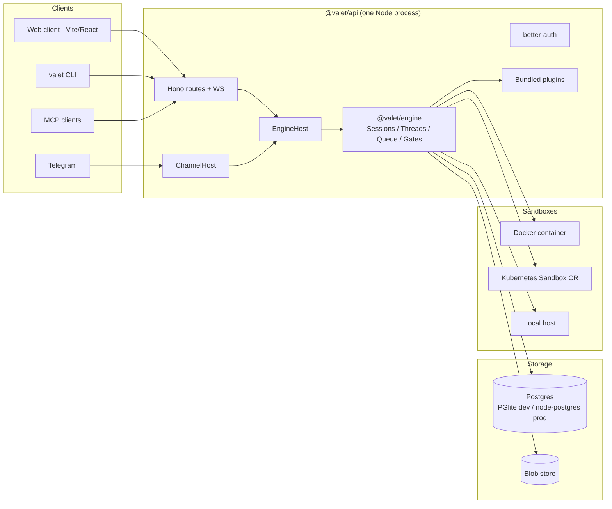
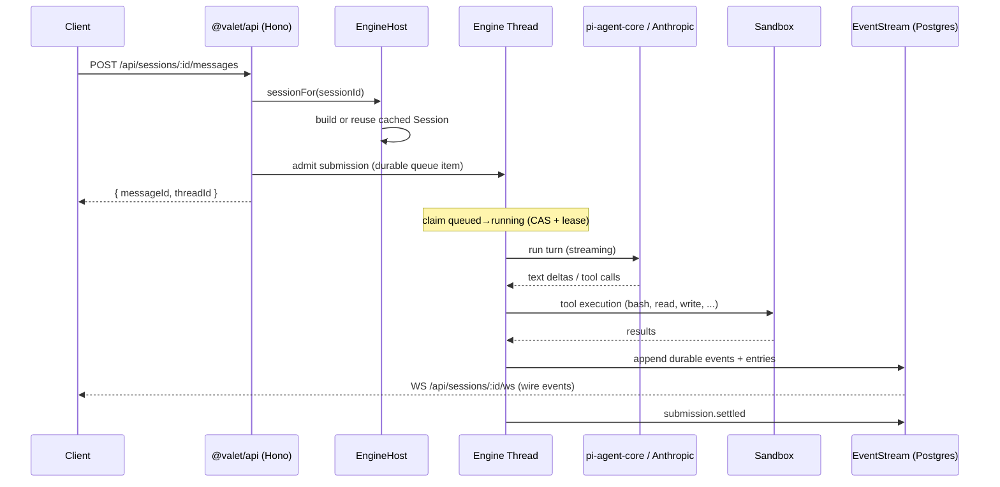

# Architecture Deep Dive

Valet is a hosted background coding agent platform. A single Node server
(`packages/api`) hosts the portable agent engine (`packages/engine`), persists
everything to Postgres (`packages/store-postgres`), and provisions isolated
sandboxes through pluggable providers (Docker, Kubernetes, or the local host).
Users reach it through a web client (`packages/web`), chat channels (Telegram),
a CLI (`valet`), or MCP.



## Package Map

| Package | Role |
|---------|------|
| `packages/api` | The product server: Hono routes, WebSocket, auth, EngineHost, ChannelHost, plugin registry, CLI, single-binary build |
| `packages/engine` | Portable agent runtime: sessions, threads, durable submissions, decision gates, tools, compaction. Zero platform dependencies; everything injected via providers |
| `packages/store-postgres` | `SessionStore` + `EventStream` over Postgres (embedded PGlite in dev, node-postgres `Pool` in prod) |
| `packages/web` | Web client: Vite + React 19, TanStack Router/Query, Zustand, Tailwind, Radix |
| `packages/sandbox-docker` | Sandbox provider: long-running container + host bind mount |
| `packages/sandbox-kubernetes` | Sandbox provider: `Sandbox` CRs via the agent-sandbox controller; the only backend with hibernation |
| `packages/sandbox-local` | Sandbox provider over the host fs/processes (dev/test only, no isolation) |
| `packages/sandbox-gateway` | Reverse proxy that runs *inside* a `full`-profile sandbox (terminal, VS Code) |
| `packages/plugin-*` | Self-describing plugins: actions, triggers, skills, roles, credentials, channel transports |
| `packages/sdk`, `packages/shared` | Contracts and shared types |
| `packages/worker`, `packages/client`, `packages/runner`, `backend/` | Frozen legacy stack (Cloudflare Worker + Modal); not part of the v2 runtime |

## Request Flow

One prompt, end to end:



Key properties:

- **The agent is instant; the sandbox is lazy.** Session state restores from
  the store in milliseconds and the turn starts immediately. The sandbox is a
  disposable resource attached asynchronously — only sandbox-requiring tool
  calls wait on it.
- **Durable-by-default.** Every accepted prompt is a durable submission with an
  explicit lifecycle (`queued → running → settled`, with leases, attempt
  markers, and two-phase settlement). A crash or restart never loses accepted
  work: on boot the server reconciles every session with unsettled submissions.
- **Replayable events.** Events are an offset-addressed durable log per
  session, not fire-and-forget. Reconnecting clients resume from an offset.

## The Engine

`@valet/engine` is a portable library with no platform dependencies. The host
constructs an `Engine` with a `ProviderBundle`:

| Provider | Interface | Production impl |
|----------|-----------|-----------------|
| `store` | `SessionStore` | `PgSessionStore` (store-postgres) |
| `stream` | `EventStream` | `PgEventStream` (store-postgres) |
| `sandboxProvider` | `SandboxProvider` | docker / kubernetes / local |
| `credentials` | `CredentialProvider` | API's encrypted `credentials` table |
| `blobs` | `BlobStore` | filesystem under `~/.valet/blobs` |

### Sessions, threads, entries

- A **session** is the unit of ownership, workspace, and sandbox attachment.
  Purposes: user session, orchestrator, `child`, `workflow`.
- A **thread** is the concurrency, history, and FIFO boundary. Each
  thread owns its own pi-agent-core `Agent`. Threads within a session run
  concurrently. Prompts within a thread queue in order. Queue modes
  control steering vs follow-up behavior.
- **Entries** form the transcript DAG (`message`, `compaction`,
  `branch_summary`, `decision_gate`). `Thread.handleAgentEvent` is the
  canonical persistence path: `message_end` appends entries, and tool
  completion mutates the part and re-persists via `updateEntry`.
  Compaction summarizes on context overflow.

### Durable submissions

`SessionStore` implements a full submission lifecycle: idempotent admission by
`dispatchId` (with steer supersession and a per-session pending cap), CAS
claiming of the runnable head, lease renewal and expiry sweeps, attempt
markers, abort requests, and fenced two-phase settlement
(`reserveSettlement` / `finalizeSettlement`). Boot-time reconciliation restores
every session that still has unsettled work.

### Decision gates

Approvals, questions, and credential requests are persisted engine primitives
(`DecisionGate`, types `approval | question | credential_request`). A tool
calls `ctx.requestDecision(...)`; the turn suspends durably
(`engine_suspended_turns`) and resumes when the gate is resolved — from the
web UI, the CLI (`valet gates`), or a chat channel (Telegram inline keyboard).
Gates survive restarts and expire on a timer.

### Tools

Built-in tools: `read`, `write`, `edit`, `bash`, `thread_read` (with job-mode
execution for long-running commands). Plugin actions are bridged into the same
`ToolDef` shape. `ToolContext` gives tools identity (`userId`/`orgId`/
`sessionId`/`threadId`), the credential provider, the sandbox handle, decision
gates, and thread reads.

## API Server

### Boot

`src/main.ts` boots on `PORT` (default `8787`. `make dev-local` runs on
`8788`): load auth config → build providers → wire the attention router →
reconcile unsettled sessions → re-arm child watches → start channel ingress,
workflow run host, and prebuild service → build better-auth → serve HTTP + WS
(Node adapter in dev, Bun adapter inside the compiled binary). The web client's
static build is served from the same process with an SPA fallback.

### Routes

All JSON under `/api`, gated by the auth middleware (below). The major
surfaces:

| Prefix | Purpose |
|--------|---------|
| `/api/sessions` | Session CRUD, pause/delete, per-session sandbox JWTs; `/:id/messages`, `/:id/threads`, `/:id/decisions` for history, prompts, and gates |
| `/api/orchestrator` | Ensure/get the per-user orchestrator session, its info and children |
| `/api/workflows` | Workflow definitions, runs, approvals, cancel |
| `/api/credentials` | Integration credentials: OAuth connect flow + manual CRUD |
| `/api/me`, `/api/me/github`, `/api/me/identity-links` | Profile, GitHub App OAuth, chat identity linking |
| `/api/org`, `/api/org/invites`, `/api/org/llm-providers`, `/api/org/github-app`, `/api/org/image-catalog`, `/api/org/prebuilds` | Single-org settings, invites, BYO LLM keys, GitHub App, sandbox image prebuilds |
| `/api/teams`, `/api/admin`, `/api/memory`, `/api/notifications`, `/api/models`, `/api/plugins`, `/api/repos` | Teams, admin submission surface, memory tree, attention notifications, model catalog, plugin list, repo listing |
| `/api/channels/:type/webhook` (public) | Channel webhook ingress |
| `/webhooks/github-app` (public) | GitHub App webhooks (HMAC-verified) |
| `/mcp` (public, OAuth-guarded) | MCP endpoint |
| `/api/sessions/:id/gateway/*`, `/api/sessions/:id/ws` | Sandbox gateway proxy and the session WebSocket |

### WebSocket and wire protocol

One socket per session at `GET /api/sessions/:id/ws`. On open the server sends
an `init` frame that is **metadata-only** — thread history always loads via
REST (`GET /api/sessions/:id/messages?threadId=…`), so reconnects never clobber
thread state. Durable events carry an `offset`; clients resume with
`?fromOffset=` and the server replays the log before splicing in live events.

Wire event types: `init`, `message_start`, `text_delta`, `message_update`,
`message_end`, `tool_start`, `tool_end`, `status`, `turn_end`, `error`,
`model_switched`, `decision_gate`, `decision_gate_resolved`,
`decision_gate_expired`, `decision_gate_withdrawn`, `queue.state`,
`submission.settled`, `sandbox.status`, `ping`.

## Auth

Real auth is [better-auth](https://better-auth.com) over the same Postgres,
enabled by setting `BETTER_AUTH_SECRET`. It provides email/password, optional
Google/GitHub social login, and generic OIDC SSO (Keycloak-ready) via the SSO
plugin — all-or-none env pairs (`AUTH_OIDC_ISSUER/CLIENT_ID/CLIENT_SECRET`,
etc.), surfaced to the login page through `GET /api/auth-config`. The first
signup becomes org admin. Without the secret, `VALET_LOCAL_AUTH=1` runs a
stub identity for local dev.

The middleware resolves callers in priority order:

1. `x-valet-internal` — the server calling itself (orchestrator tools).
2. `x-valet-sandbox` — a sandbox bearer token, valid **only** on
   `/api/memory` and `/api/sandbox` (git credential helper).
3. Browser session cookie (better-auth).
4. `x-api-key` — API keys (`vlt_` prefix) for the CLI and automation.
5. Local stub (dev only).

Other credential surfaces:

- **Org roles**: `org_members.role` is `admin | member`. Admin gates the
  org settings and invite routes.
- **MCP OAuth**: `/mcp` is guarded by better-auth's MCP plugin — standard
  OAuth discovery (`/.well-known/oauth-authorization-server`), dynamic client
  registration, Bearer tokens. This is distinct from `x-api-key`.
- **Sandbox gateway JWTs**: short-lived HS256 tokens minted per session
  from a per-session secret derived from a master key. The in-sandbox
  gateway verifies the signature *and* that the `sid` claim matches its
  own `VALET_SESSION_ID`. A token for one session is therefore useless
  inside another.
- **Integration credentials** are AES-256-GCM encrypted at rest
  (`VALET_ENCRYPTION_KEY`) in the `credentials` table, keyed by owner +
  service.

## Sandboxes

The engine sees one interface — `SandboxProvider` (`create`/`restore`/
`destroy`/`status`, optional `suspend`/`resume`/`release`) yielding a `Sandbox`
handle (file ops, `exec`, job-mode exec, optional gateway endpoint). Backend
selection is `VALET_SANDBOX_BACKEND` (`docker` default, `local`,
`kubernetes`).

| Backend | Isolation | Hibernation | Custom image | Notes |
|---------|-----------|-------------|--------------|-------|
| docker | Long-running container, host bind mount at `/workspace` | no | yes | Default image `node:20-bookworm`; fs ops run on the host against the mount |
| kubernetes | `Sandbox` CR + pod, PVC workspace | **yes** | yes | CRs served by the vendored agent-sandbox controller (`agents.x-k8s.io/v1beta1`); suspend patches `operatingMode: Suspended` (pod scales to zero, PVC survives) |
| local | none — host fs/processes | no | no | Dev/test only |

**Profiles.** Every sandbox boots the SAME image (one lineage, built from
`docker/Dockerfile.sandbox-k8s` — see
`docs/specs/2026-08-16-single-image-lineage-design.md`); the profile only
decides which services start. `headless` (default) runs nothing but the
agent's commands. `full` also starts, via `/start-full.sh`: code-server
(`:8765`), ttyd (`:7681`), and the sandbox gateway (`:9000`) — the terminal
and VS Code tabs in the UI. The browser reaches them through the API's
authenticated proxy (`/api/sessions/:id/gateway/*`), which checks session
ownership and forwards a gateway JWT. The in-sandbox gateway
independently verifies that JWT.

**Environment.** Every sandbox receives `VALET_SANDBOX_TOKEN` (bearer for
calling back into the API — used by the git credential helper, so no git
credentials are ever written into the sandbox), `VALET_API_URL`,
`VALET_SANDBOX_JWT_SECRET`, `VALET_SESSION_ID`, and `VALET_SANDBOX_PROFILE`.

**Hibernation.** A host-wide sweep (`VALET_SANDBOX_IDLE_MINUTES`, default 30)
suspends idle sandboxes on backends that support it (Kubernetes today).
Interactive terminal/editor activity keeps a sandbox alive, and a
just-admitted submission wins over the sweep. `agent_sessions.status` tracks
`active | hibernated | archived | deleted`.

## Data Model

Two schema domains share one Postgres database. Dev/test uses embedded PGlite
(`.valet-dev/pg` in the worktree under `make dev-local`, `~/.valet/pg`
otherwise); setting `DATABASE_URL` switches to node-postgres. Both are
single pre-1.0 `0000` migrations, edited in place.

**Engine tables** (`packages/store-postgres/migrations/pg/0000_engine.sql`):
`engine_sessions`, `engine_threads`, `engine_entries` (transcript DAG),
`engine_queue_items` (durable submissions), `engine_attempt_markers`,
`engine_decision_gates`, `engine_decision_gate_refs`,
`engine_suspended_turns`, `engine_events` (durable event log), `engine_meta`
(schema version).

**App tables** (`packages/api/migrations/pg/0000_app.sql`, Drizzle schema in
`packages/api/src/schema/index.ts`), by domain:

| Domain | Tables |
|--------|--------|
| Identity & auth | `orgs`, `user`, better-auth tables (`session`, `account`, `verification`, `sso_provider`, `apikey`, `oauth_application`, `oauth_access_token`, `oauth_consent`), `org_members`, `invites`, `sandbox_tokens` |
| Sessions & UI | `agent_sessions`, `session_threads`, `messages` |
| Teams | `teams`, `team_members` |
| Orchestrator & attention | `assistants`, `child_watches`, `notifications`, `user_notification_preferences`, `event_drop_log` |
| Channels | `channel_bindings`, `user_identity_links`, `identity_link_codes` |
| Memory | `memory_files` (tsvector full-text search) |
| Workflows | `workflow_definitions`, `workflow_runs`, `workflow_checkpoints`, `workflow_signals`, `action_invocations` |
| Credentials & repos | `credentials` (encrypted), `mcp_oauth_clients`, `llm_providers`, `session_repos`, `github_installations`, `image_catalog`, `prebuild_configs`, `prebuilds` |

## Plugins

A plugin is a package exporting a single `ValetPlugin` manifest from
`./plugin` (marked `"valet": { "plugin": ... }` in `package.json`):

```ts
{ name, version, description?,
  actions?,      // agent tools, grouped by service
  triggers?,     // webhook triggers: verify(raw) → toSignal(event)
  skills?,       // markdown skills delivered to the agent
  roles?,        // personas
  credentials?,  // declarations: oauth2 | api_key | bot_token | service_account
  transports? }  // channel transports (e.g. Telegram)
```

`make generate-registries` scans `packages/plugin-*/plugin.yaml` for
`v2: true` and generates `packages/api/src/plugins/registry.gen.ts`. 17
plugins are bundled today (GitHub, Slack, Linear, Notion, Gmail, Google
Calendar/Workspace, Telegram, Stripe, Sentry, Cloudflare, browser, workflows,
personas, and more). External plugins are also discovered from `node_modules`
by the same marker. Credential declarations drive the Integrations page: an
`oauth2` declaration with OAuth metadata renders a Connect button and the
server runs the flow (including MCP-style dynamic client registration).

## Channels

`ChannelHost` runs channel ingress inside the API process. For each plugin
transport with an org credential it either **long-polls** (default, zero
config) or **registers a webhook** at
`/api/channels/:type/webhook` — chosen by whether a public URL is available
(`VALET_PUBLIC_URL`, or a public `BETTER_AUTH_URL`). Inbound messages are
deduplicated, resolved to a linked user (`/start <code>` deep-link flow →
`user_identity_links`), and submitted as prompts to that user's orchestrator
session on a per-conversation thread. Outbound, the host subscribes to the
event stream and delivers assistant replies and decision gates (Telegram
renders gates as inline keyboards). Telegram is the reference transport.

## Orchestrator

Each user's orchestrator is a full engine session — same threads, queue, and
gates — with a persona, memory tools (`mem_*` over the `memory_files` tree),
a daily journal, and a `childSpawner` for launching child coding sessions
(depth-limited to 1). It runs sandbox-less. An **attention router** turns
stuck submissions and pending decision gates into notifications, delivered
in-app and DM'd over linked channels. A gate goes to the owner who can answer
it: the parent's owner for a child session, the session's own owner for every
other session.

## Workflows

Workflow definitions and runs are app-level tables executed by a workflow run
host inside the API process (leased, crash-safe, with checkpoints and
signals). Workflow steps consume engine primitives — durable submission ids,
settled events, transcript reads — and human approval nodes surface through
the same decision-gate machinery.

## CLI

`packages/api` ships a single `valet` binary (Bun `--compile`, cross-compiled
per OS/arch, embedding the web client's build):

| Command | Purpose |
|---------|---------|
| `valet serve` | Boot the whole product (API + web + embedded PGlite) |
| `valet login <url>` / `logout` / `instance` | Manage named instance profiles in `~/.valet/config.json` |
| `valet sessions` / `send` / `chat` | List/create sessions, send prompts, interactive TUI chat |
| `valet gates` | List and resolve decision gates |
| `valet status` / `config` / `reset` | Health + version skew, edit serve config, wipe local state |
| `valet mcp setup` | Wire a local agent (Claude Code) to the instance's `/mcp` endpoint |

Option precedence is flag > env > config file > default. `serve` claims an
exclusive `serve.lock` pidfile per data dir so two servers never share one
PGlite.

## Deployment

**Local dev** — `make dev-local`: API on `:8788` (`VALET_LOCAL_AUTH=1`,
Docker sandbox backend) + Vite web on `:5173`. Requires `ANTHROPIC_API_KEY`
and a Docker daemon.

**Kubernetes** — a Helm chart (`deploy/chart/valet`) deploys:

- `valet-api` (**one replica** — the engine is a stateful singleton: in-memory
  submission loop and WS fan-out, no leader election), ClusterIP + Traefik
  ingress, chart-generated-and-retained secrets.
- Bundled `postgres:17` StatefulSet (or `externalDatabase.url`).
- Bundled OCI `registry:2` + nightly GC, fed by BuildKit jobs that build
  prebuilt sandbox images (the prebuild/image-catalog system).
- Sandboxes in a **separate namespace** (`valet-sandboxes`) with narrowly
  scoped RBAC; the vendored agent-sandbox controller (CRD + validating
  webhook) must be installed first (`make k8s-sandbox-install`).

`make k8s-build` / `k8s-up` / `k8s-logs` / `k8s-down` drive the local
Rancher Desktop flow. Every target pins `--context rancher-desktop`.

## Port Summary

| Port | What |
|------|------|
| 8787 | API default (`PORT`); Helm chart |
| 8788 | API in `make dev-local` |
| 5173 | Vite dev server (web) |
| 9000 | Sandbox gateway (inside `full` sandboxes) |
| 8765 | code-server (behind the gateway) |
| 7681 | ttyd web terminal (behind the gateway) |
