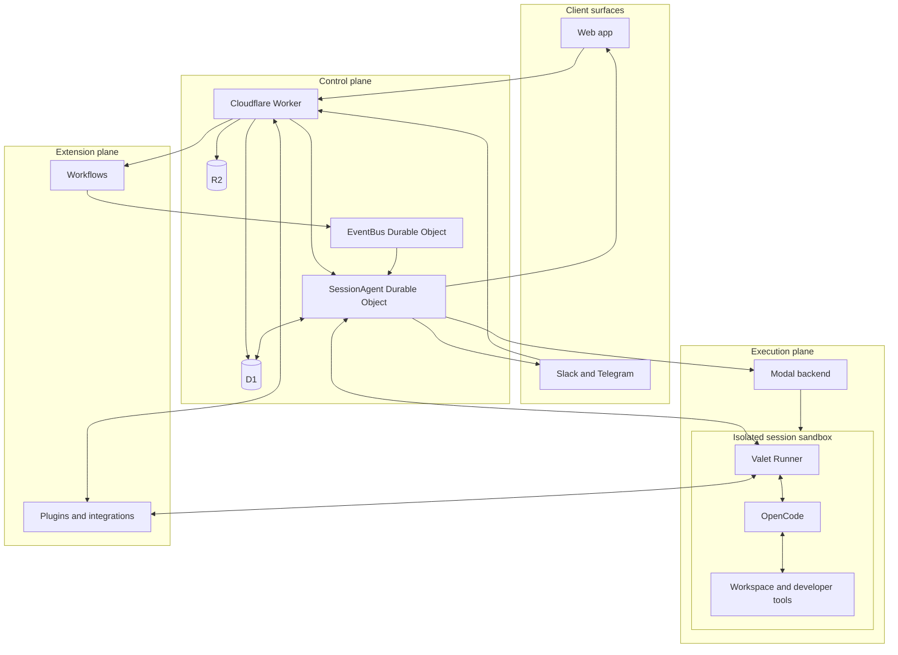

Valet is a control plane for isolated agent workspaces. People and connected channels send work to Valet; its control plane coordinates a session; and an isolated sandbox runs the agent against a real workspace.

## System overview

The diagram shows the primary ownership boundaries, not every API or event. The Worker is Valet's public entry point; a per-session Durable Object owns live coordination; and each agent runs in its own sandbox.

## How work moves through Valet

1. **Receive.** A user sends a message from the web app, Slack, or Telegram. The Cloudflare Worker authenticates the request, applies access and policy checks, and finds the target session or orchestrator.
2. **Coordinate.** The session's `SessionAgentDO` records live state, accepts client and runner WebSockets, queues prompts, and starts or wakes a sandbox when work needs one.
3. **Execute.** The Modal backend provisions an isolated sandbox. Valet Runner bridges the session WebSocket to OpenCode, which uses the workspace, developer tools, and approved integrations to perform the work.
4. **Stream and persist.** Runner sends structured progress and results to the session coordinator. The coordinator broadcasts updates to connected clients and channels while the Worker persists durable records and artifacts in D1 and R2.

## Responsibility boundaries

| Layer | Primary responsibility |
| --- | --- |
| Client surfaces | Present sessions and deliver messages from the web app and supported chat channels. |
| Cloudflare Worker | Public API, authentication, authorization, routing, integration entry points, and durable application records. |
| SessionAgent Durable Object | Per-session coordination: live connections, prompt queueing, streaming, sandbox lifecycle, and transient session state. |
| Modal backend and sandbox | Isolated compute, workspace lifecycle, and the tools needed to work in a repository. |
| Runner and OpenCode | Translate between Valet's session protocol and the agent runtime, then perform the requested work. |
| Plugins and workflows | Extend the system with tools, integrations, channel transports, personas, and durable automation. |

## State and security boundaries

Valet keeps durable application records in D1 and artifacts such as screenshots or attachments in R2. `SessionAgentDO` is the authority for live session coordination: connected clients, runner availability, prompt queues, and in-flight streamed work. The detailed lifecycle and reconciliation rules live in [Session Lifecycle](/engineering/session-lifecycle).

The Worker authenticates people and applies session-access rules before they reach a session. It issues short-lived credentials for sandbox-facing services; inside the sandbox, Runner's gateway validates access before proxying developer tools. OAuth credentials, integration actions, and approval policy are handled by their own subsystems rather than exposed as general sandbox access.

## Engineering deep dives

Use these focused references when you need the contract or behavior of a particular subsystem:

| Topic | What it covers |
| --- | --- |
| [Session Lifecycle](/engineering/session-lifecycle) | Session types, state transitions, prompt queues, live-state authority, and session APIs. |
| [Sandbox Lifecycle](/engineering/sandbox-lifecycle) | Sandbox topology, boot, persistence, hibernation, restore, and image composition. |
| [Runner and OpenCode](/engineering/runner-and-opencode) | The sandbox bridge, agent supervision, runtime configuration, and gateway. |
| [Real-time Streaming](/engineering/real-time-streaming) | Client and runner WebSockets, event contracts, reconnect behavior, and channel routing. |
| [Workflow Execution](/engineering/workflow-execution) | Workflow definitions, triggers, execution records, approvals, and the interpreter. |
| [Orchestrator Runtime](/engineering/orchestrator-runtime) | Persistent orchestrator sessions, memory, mailbox, channel routing, and child work. |
| [Plugin System](/engineering/plugin-system) | Plugin packages, generated registries, actions, channels, skills, personas, and tools. |
| [Integration System](/engineering/integration-system) | Action versus channel integrations, native and MCP-backed actions, and webhook handling. |
| [Policy Engine](/engineering/policy-engine) | Policy resolution, approval prompts, overrides, audit records, and failure behavior. |
| [Auth and Access Internals](/engineering/auth-access-internals) | OAuth, app tokens, organization gates, session access, and workspace JWTs. |
