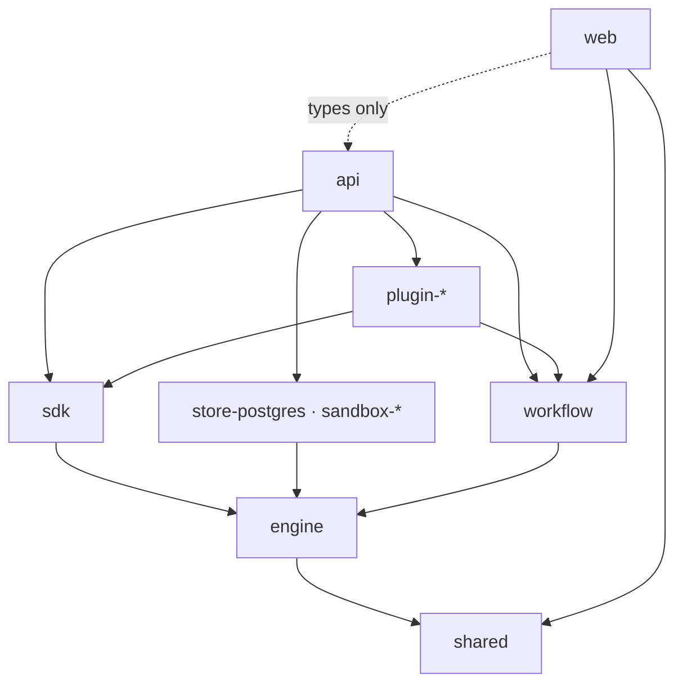

# Placement guide

Decide which package a new file goes in.

Valet is a pnpm workspace of about forty packages. The packages form layers, and
the layers import downward only. Put a file in the wrong package and you get one
of two failures: an upward import that `pnpm typecheck` rejects, or a downward
import that compiles today and traps unrelated code tomorrow.

**Scope.** Applies to types, contracts, services, routes, components, hooks, and
plugin code — anything you are adding under `packages/`. For what the packages
are and how a request flows through them, read
[architecture.md](../architecture.md). This guide tells you which package a
specific file belongs to. For the order to build a change in, read
[building-a-feature.md](./building-a-feature.md).

## How to use this guide

Run the decision tree from Q1 to Q7. Answer each question about your specific
file. Stop at the first question that answers yes, and take the path it gives.
The questions run from the most restrictive home to the least, so an early match
is the stricter and better answer.

**Split mixed files before you place them.** If one file exports two things that
belong in different packages, split it first. A file cannot live in two layers.

**Fixing a bug in an existing file?** Fix it where it is. Do not expand scope.
This tree is for new files, and for files you have already decided to move.

## Dependency direction

Each package imports only from packages below it. This table records what the
`package.json` files declare today, not what they could declare.

| Package | Role | May import from |
| --- | --- | --- |
| `web` | Browser client | `api` (types only), `shared`, `workflow` |
| `api` | HTTP surface, composition root | everything below |
| `plugin-*` | One integration or skill each | `engine`, `sdk`, `shared`, `workflow` |
| `sdk` | Contracts plugins and the api share | `engine`, `shared` |
| `store-postgres`, `sandbox-*` | Backend implementations of engine contracts | `engine` |
| `workflow` | Workflow DAG interpreter | `engine` |
| `engine` | The portable agent loop | `shared` |
| `shared` | Cross-package types and errors | nothing |



`shared` is the only leaf. `api` is the composition root: the one package that
knows every plugin, every sandbox provider, and the store.

**Never import upward.** `engine` cannot import from `api`. A plugin cannot
import another plugin. If code needs to move against an arrow, move the code
down — do not add the import.

## Decision tree

### Q1. Is it a type or an error that two or more packages need?

Yes when the shape crosses a package boundary and carries no behavior.

**Yes → `packages/shared/src/`.**

`shared` has no dependencies and must keep none. It holds types, error classes,
and small pure helpers. Never a database call, an HTTP call, or agent behavior.

```ts
// Wrong — the api and the engine each declare their own copy.
// packages/api/src/sessions/types.ts
export type RunState = "queued" | "running" | "done";
// packages/engine/src/types.ts
export type RunState = "queued" | "running" | "done" | "failed";  // drifted

// Right — one declaration both sides import.
// packages/shared/src/types/index.ts
export type RunState = "queued" | "running" | "done" | "failed";
```

**No → Q2.**

### Q2. Is it agent-loop behavior?

Yes for anything deciding how a session runs: thread handling, the submission
queue, decision gates, compaction, tool bridging, skills and roles, or a
persistence *contract*.

**Yes → `packages/engine/src/`.**

Check it against the portability rule before you write it. If the code needs a
Hono context, a request object, a `pg` client, or an environment variable, it
does not belong in `engine`. Express the need as a contract here, and implement
it where the outside world lives.

```ts
// Wrong — engine reaches for the database directly.
// packages/engine/src/session.ts
import { Pool } from "pg";                       // engine has no pg dependency
const rows = await pool.query("SELECT * FROM sessions WHERE id = $1", [id]);

// Right — engine declares the contract; store-postgres implements it.
// packages/engine/src/types.ts
export interface SessionStore {
  saveSession(session: SessionData): Promise<void>;
  saveThread(sessionId: string, thread: ThreadData): Promise<void>;
  appendEntries(
    sessionId: string,
    threadId: string,
    entries: SessionEntry[],
    fence?: WriteFence,
  ): Promise<void>;
}
```

`SessionStore` and `SandboxProvider` are the two worked examples already in the
tree. Both live in `packages/engine/src/types.ts`.

**No → Q3.**

### Q3. Does it implement an engine contract for one specific backend?

Yes when the file is the Postgres half of `SessionStore`, or the Docker,
Kubernetes, or local half of `SandboxProvider`.

**Yes → `packages/store-postgres/src/` or `packages/sandbox-<backend>/src/`.**

Keep backend detail inside the backend package. When two backends need the same
helper, that helper belongs in `engine` beside the contract. A helper copied
into one provider makes the providers diverge silently, and the shared
conformance suites are what stop that.

Row mapping is the common case here. Raw SQL columns become typed rows through
the `rawTo*Row` mappers in `packages/store-postgres/src/helpers.ts`. Bigint
millisecond columns arrive as strings from the driver, so they funnel through
`toNum`:

```ts
// packages/store-postgres/src/helpers.ts
export function rawToEntryRow(raw: Record<string, unknown>): EntryRow {
  return {
    id: asString(raw.id, "id"),
    sessionId: asString(raw.session_id, "session_id"),
    parts: asStringOrNull(raw.parts, "parts"),
    createdAt: toNum(raw.created_at, "created_at"),   // bigint ms → number
  };
}
```

**No → Q4.**

### Q4. Does it define workflow DAG semantics?

Yes for node types, the interpreter, expression resolution, or the validation a
workflow runs before it executes.

**Yes → `packages/workflow/src/`.**

`workflow` is imported by `api`, by `web`, and by plugins. Everything here ships
to the browser, so keep server-only code out.

**No → Q5.**

### Q5. Does it integrate one third-party service?

Yes for the actions, skills, roles, and client code of a single external product.

**Yes → `packages/plugin-<name>/src/`.**

One package per integration. A plugin declares itself through a `ValetPlugin`
manifest default-exported from `./plugin`:

```ts
// packages/plugin-openai/src/plugin.ts
import type { ValetPlugin } from "@valet/engine";
import { openaiPlugin } from "./actions.js";

/**
 * No `credentials` declaration on purpose: the OpenAI key is not a
 * user-connectable integration. The api's session credential resolver
 * answers `credentials.get("openai")` from the org's OpenAI LLM-provider
 * key, a stored "openai" credential, or the OPENAI_API_KEY env var.
 */
const plugin: ValetPlugin = {
  name: "openai",
  version: "0.1.0",
  description: "OpenAI media tools — image generation and editing, transcription, text to speech",
  actions: [openaiPlugin],
};

export default plugin;
```

A plugin that *is* user-connectable adds a `credentials` array describing what
the user connects, and the MCP-backed integrations build their whole `actions`
array from one `mcpActionPlugin({ … })` call. The doc comment above is the
convention worth copying: when a manifest omits a field other plugins carry,
say why.

A plugin never imports another plugin:

```ts
// Wrong — plugin-to-plugin import.
import { formatIssue } from "@valet/plugin-linear";

// Right — the shared contract lives in sdk, the shared type in shared.
import { mcpActionPlugin } from "@valet/sdk/mcp";
import type { IssueRef } from "@valet/shared";
```

Run `make generate-registries` after you add one, and follow the full setup in
[CLAUDE.md](../../CLAUDE.md#adding-a-plugin-v2). A plugin that skips the
`tsconfig.json` references or the root `tsconfig.json` entry builds locally and
fails `pnpm typecheck`.

**No → Q6.**

### Q6. Does it serve HTTP, or wire the server together?

Yes for routes, middleware, authentication, webhooks, the engine host, channel
wiring, the CLI, and app-table schema.

**Yes → `packages/api/src/`.**

| What you are adding | Where it goes |
| --- | --- |
| A REST route | `routes/<area>.ts`, mounted in `app.ts` |
| Request middleware | `middleware/` |
| Engine host and bridge wiring | `engine/` |
| App table schema | `schema/index.ts` + `migrations/pg/0000_app.sql` |
| A CLI command | `cli/`, as a pure `run*` function |
| A type the browser also needs | `wire/types.ts` — see the wire rule |

`api` is the composition root, so it is the easiest package to overfill. Before
you add business logic here, ask whether `engine`, a plugin, or `workflow` should
own it. A route reads a request, calls something, and shapes a response:

```ts
// Wrong — the decision lives in the route.
modelsRouter.get("/", async (c) => {
  const rows = await c.var.providers.db.select().from(models);
  const usable = rows.filter((r) => r.active && r.key && !r.disabled && r.orgId === ...);
  return c.json({ models: usable.map(/* … 30 lines of shaping … */) });
});

// Right — the route wires; a service decides.
modelsRouter.get("/", async (c) => {
  const { db, engineCredentials } = c.var.providers;
  const entries = await buildOrgCatalog(db, engineCredentials, c.var.user.orgId);
  const models = entries.filter((e) => e.active).map(({ resolvable, ...m }) => m);
  const resp: ListModelsResponse = { models };
  return c.json(resp);
});
```

**No → Q7.**

### Q7. Is it browser UI?

**Yes → `packages/web/src/`.**

| What you are adding | Where it goes |
| --- | --- |
| A page | `routes/<name>.tsx` — the file path is the URL |
| A test for a page | `routes/-<name>.test.tsx` — note the leading `-` |
| A shared component | `components/` |
| A tool renderer | `components/session/tool-renderers/` + `index.ts` |
| A data hook or client call | `api/` |
| Client state | `stores/` |

The router generates `routeTree.gen.ts` from `routes/`. Any file there becomes a
URL unless its name starts with `-`:

```text
routes/settings.test.tsx     # Wrong — publishes a /settings.test route
routes/-settings.test.tsx    # Right — excluded from the route tree
```

`routeTree.gen.ts` is generated and gitignored — it is never committed, so a
hand edit does not survive and does not appear in your diff. Rename the route
file instead. Import
web's own modules through the `~` alias, which resolves to `packages/web/src`.

**No → read the escape hatch.**

## The wire rule

`web` imports types from `api`, and that import is deliberately narrow. `api`
publishes exactly three entry points — `.`, `./wire`, and `./memory-links` — and
the browser uses `@valet/api/wire`.

When the browser needs a shape the server produces, declare it in
`packages/api/src/wire/types.ts` and import it as a type on both sides:

```ts
// Wrong — the browser redeclares the server's response.
// packages/web/src/api/models.ts
type ListModelsResponse = { models: { id: string; label: string }[] };

// Right — one declaration, imported by both.
// packages/api/src/wire/types.ts
export interface ListModelsResponse { models: ModelInfo[] }
// packages/web/src/api/models.ts
import type { ListModelsResponse } from "@valet/api/wire";
```

A copied response type drifts on the first server change, and it drifts silently,
because both sides still compile.

Do not widen `api`'s exports to reach a server module from the browser.
`memory-links` is the exception that shows the shape of the rule: a pure
function with no server dependencies, given its own export. A fourth export
needs the same justification.

## Escape hatch

If no question resolves, or two feel equally right, you are looking at code with
one consumer and no obvious home. Put it beside the code that uses it, and
promote it when a second consumer appears.

A helper next to its only caller is easy to move. A helper placed in a shared
package before anyone needs it there is hard to remove, because you cannot tell
who depends on it. Promote on the second consumer, not on the first guess about
a future one.

When you do raise the case for review, bring three things: the item you are
placing, the two closest packages you considered, and why neither fits.

## Worked examples

**Point-in-time snapshot.** These cite real files as of the last update to this
guide. If an example disagrees with the repo, the code is right — update the
example in the same PR that moved the file.

**1. A `RunState` union the api and the web both render**

- Q1: needed by two packages, no behavior? Yes.
- **Home:** `packages/shared/src/types/index.ts`

**2. Retry behavior for a failed tool call**

- Q1: it is behavior, not a type. No.
- Q2: it decides how a session runs? Yes.
- **Home:** `packages/engine/src/`

**3. A Postgres index for session lookups**

- Q2: is it loop behavior? No — it is how one backend stores rows.
- Q3: one specific backend? Yes.
- **Home:** `packages/store-postgres/migrations/pg/0000_engine.sql`

**4. A `foreach` node option**

- Q3: a backend implementation? No.
- Q4: DAG semantics? Yes.
- **Home:** `packages/workflow/src/dag/`

**5. A "create issue" action for an issue tracker**

- Q4: DAG semantics? No.
- Q5: one third-party service? Yes.
- **Home:** `packages/plugin-<tracker>/src/plugin.ts`

**6. A helper two plugins both need to sign a webhook**

- Q5: one service? No — two plugins need it, and plugins never import plugins.
- **Home:** `packages/sdk/src/` (a contract) or `packages/shared/src/` (a type)

**7. `GET /api/sessions/:id/artifacts`**

- Q6: serves HTTP? Yes.
- **Home:** `packages/api/src/routes/sessions.ts`, mounted in `app.ts`

**8. The response shape that route returns**

- Q6 plus the wire rule: the browser reads it.
- **Home:** `packages/api/src/wire/types.ts`

**9. The panel that renders those artifacts**

- Q7: browser UI? Yes.
- **Home:** `packages/web/src/components/`

**10. A renderer for a new plugin's tool calls**

- Q7: browser UI? Yes, and the registry is the mounting point.
- **Home:** `packages/web/src/components/session/tool-renderers/<tool>.tsx`,
  listed in `index.ts` above `fallbackRenderer`

## Anti-patterns

**A database call in `engine`.** Express it as a contract and implement the
contract in `store-postgres`. This is the one rule that keeps the engine
portable, and it is a locked decision.

**A plugin importing another plugin.** Move the shared piece down to `sdk` or
`shared`.

**A response type copied into `web`.** Put it in `wire/types.ts` and import it
from both sides.

**Business logic in a route.** Routes wire; the packages below them decide.

**A new export in `api/package.json` to reach one server function.** Either the
function is pure and earns its own export, or its result belongs on the wire.

**A hand edit to `routeTree.gen.ts`.** It is generated and gitignored. Rename the route file.

**"I'll promote it later."** Speculative placement in a shared package rarely
gets undone, because nobody can tell who depends on it. Co-locate instead, and
promote on the second real consumer.

**A new top-level `packages/` entry for one file.** A package carries a
`package.json`, a `tsconfig.json`, root references, and a registry entry. Use an
existing package unless you are adding a genuine integration.

## How boundaries are enforced

Valet has no import lint rule. Layering is enforced through package
dependencies and TypeScript project references: a package imports only what its
`package.json` declares, and `pnpm typecheck` runs `tsc --build` across the
references in the root `tsconfig.json`.

That has one practical consequence. Adding a dependency edge is a deliberate,
reviewable act. When a change needs a new `@valet/*` entry in a `package.json`,
treat that line as the most important line in the diff, and check it against the
table at the top of this guide.

## Evolving this guide

Edit this file when:

- A new case does not resolve → add it to the worked examples and adjust the tree.
- A question proves unanswerable in practice → reword it.
- A placement proves wrong → move the example and record why.
- You move a file this guide cites → update the example in the same PR.
