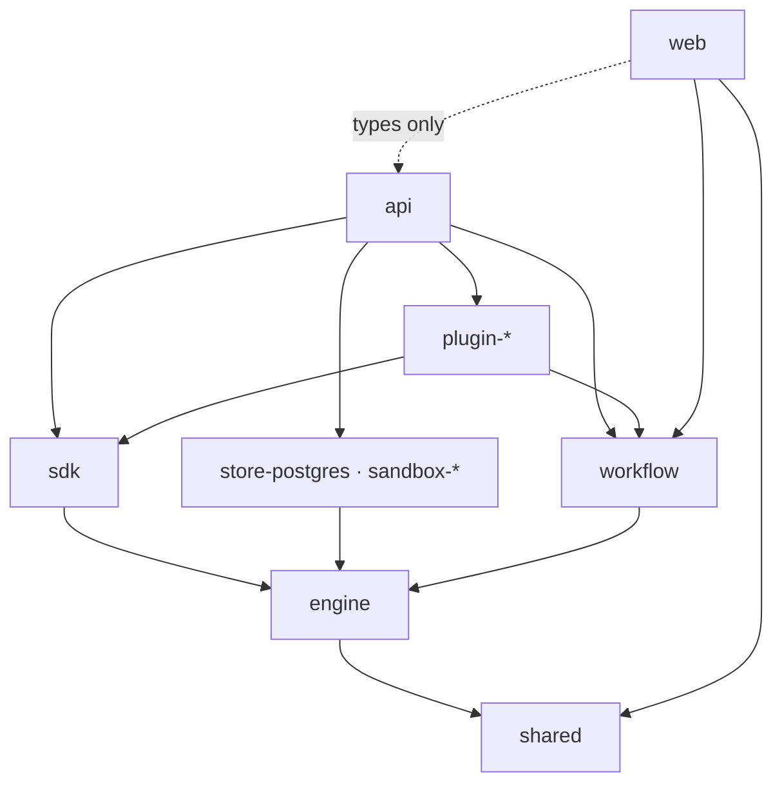

# Placement guide

Decide which package a new file belongs to.

Valet is a pnpm workspace of about forty packages. The packages form layers, and
the layers only import downward. Put a file in the wrong package and you either
create an upward import that `pnpm typecheck` rejects, or you create a downward
import that compiles today and traps unrelated code later.

This guide answers one question: given a thing you are about to write, which
package owns it? For what the packages are and how a request flows through
them, read [architecture.md](../architecture.md).

## How to use this guide

Run the decision tree from Q1 to Q7. Answer each question about your specific
file. Stop at the first question that answers yes, and use the path it gives.
The questions run from the most restrictive home to the least, so an early
match is the stricter and better answer.

If one file exports two things that belong in different packages, split the file
before you place it. A single file cannot live in two layers.

If you are fixing a bug in an existing file, fix it where it is. This tree is
for new files, and for files you already decided to move.

## Dependency direction

Each package may import only from the packages below it. The table records what
each package declares today, not what it could declare.

| Package | Role | May import from |
| --- | --- | --- |
| `web` | Browser client | `api` (types only), `shared`, `workflow` |
| `api` | HTTP surface, server wiring, composition root | everything below |
| `plugin-*` | One integration or skill each | `engine`, `sdk`, `shared`, `workflow` |
| `sdk` | Contracts that plugins and the api share | `engine`, `shared` |
| `store-postgres`, `sandbox-*` | Backend implementations of engine contracts | `engine` |
| `workflow` | Workflow DAG interpreter | `engine` |
| `engine` | The portable agent loop | `shared` |
| `shared` | Cross-package types and errors | nothing |

`shared` is the only leaf. `api` is the composition root: it is the one package
that knows about every plugin, every sandbox provider, and the store.

Two rules follow from the table, and both are load-bearing:

- **Never import upward.** `engine` cannot import from `api`. A plugin cannot
  import from another plugin. If you need code to move against an arrow,
  move the code down instead of adding the import.
- **`engine` stays portable.** It owns the loop, sessions, threads, the queue,
  gates, and the persistence contracts. It knows nothing about HTTP. It imports
  no web framework and no database driver. This is a locked decision, recorded
  in [CLAUDE.md](../../CLAUDE.md#locked-architecture-decisions).

## Decision tree

### Q1. Is it a type or an error that two or more packages need?

Answer yes when the shape crosses a package boundary and carries no behavior.
Domain entities, shared error classes, and scope keys qualify.

**Yes → `packages/shared/src/`.**

`shared` has no dependencies and must keep none. It holds types and small pure
helpers. It never holds a database call, an HTTP call, or agent behavior. When
you add a cross-package entity, add it here first, then import it from both
sides. This is cheaper than defining the type twice and reconciling the copies
later.

**No → Q2.**

### Q2. Is it agent-loop behavior?

Answer yes for anything that decides how a session runs: thread handling, the
submission queue, decision gates, compaction, tool bridging, skills and roles,
or a persistence *contract*.

**Yes → `packages/engine/src/`.**

Before you write the file, check it against the portability rule. If your code
needs a Hono context, a request object, a `pg` client, or an environment
variable, it does not belong in `engine`. Take the part that needs the outside
world, express it as a contract in `engine`, and implement that contract in the
package that owns the outside world. `SessionStore` and `SandboxProvider` are
the two worked examples already in the tree.

**No → Q3.**

### Q3. Does it implement an engine contract for one specific backend?

Answer yes when the file is the Postgres half of `SessionStore`, or the Docker,
Kubernetes, or local half of `SandboxProvider`.

**Yes → `packages/store-postgres/src/` or `packages/sandbox-<backend>/src/`.**

Keep the backend detail inside the backend package. If two backends need the
same helper, the helper belongs in `engine` beside the contract, not copied into
both. Providers swap behind the contract, and shared conformance suites hold
them to the same behavior, so a helper that lives in one provider silently makes
the providers diverge.

**No → Q4.**

### Q4. Does it define workflow DAG semantics?

Answer yes for node types, the interpreter, expression resolution, or the
validation a workflow runs through before it executes.

**Yes → `packages/workflow/src/`.**

`workflow` is imported by `api`, by `web`, and by plugins. Anything you put here
ships to the browser, so keep server-only code out of it.

**No → Q5.**

### Q5. Does it integrate one third-party service?

Answer yes for the actions, skills, roles, and client code for a single external
product.

**Yes → `packages/plugin-<name>/src/`.**

One package per integration. A plugin declares itself through a `ValetPlugin`
manifest exported from `./plugin`, and `make generate-registries` regenerates
the registry that `api` reads. A plugin never imports another plugin. When two
plugins need the same contract, that contract belongs in `sdk`; when they need
the same type, it belongs in `shared`.

The full setup for a new plugin package is in
[CLAUDE.md](../../CLAUDE.md#adding-a-plugin-v2). Follow it exactly — a plugin
that skips the `tsconfig.json` references or the root `tsconfig.json` entry
builds locally and fails `pnpm typecheck`.

**No → Q6.**

### Q6. Does it serve HTTP, or wire the server together?

Answer yes for routes, middleware, authentication, webhook handlers, the engine
host, channel wiring, the CLI, and app-table schema.

**Yes → `packages/api/src/`.**

| What you are adding | Where it goes |
| --- | --- |
| A REST route | `routes/<area>.ts`, then mount it in `app.ts` |
| Request middleware | `middleware/` |
| Engine host and bridge wiring | `engine/` |
| App table schema | `schema/index.ts` plus `migrations/pg/0000_app.sql` |
| A CLI command | `cli/`, as a pure `run*` function |
| A type the browser also needs | `wire/types.ts` — see the wire rule below |

`api` is the composition root, so it is the easiest package to overfill. Before
you add business logic here, ask whether the engine, a plugin, or `workflow`
should own it. A route should read a request, call something, and shape a
response.

**No → Q7.**

### Q7. Is it browser UI?

**Yes → `packages/web/src/`.**

| What you are adding | Where it goes |
| --- | --- |
| A page | `routes/<name>.tsx` — the file path is the URL |
| A test for a page | `routes/-<name>.test.tsx` — note the leading `-` |
| A shared component | `components/` |
| A tool renderer | `components/session/tool-renderers/`, then list it in `index.ts` |
| A data hook or client call | `api/` |
| Client state | `stores/` |

The router generates `routeTree.gen.ts` from the files in `routes/`. Any file
there becomes a URL unless its name starts with `-`. A test named
`settings.test.tsx` therefore publishes a `/settings.test` route; the same test
named `-settings.test.tsx` does not. Every route test in the tree already uses
the prefix, and `routeTree.gen.ts` is generated, so never edit it by hand.

Import `web`'s own modules through the `~` alias, which resolves to
`packages/web/src`.

**No → read the escape hatch.**

## The wire rule

`web` imports types from `api`, and that import is narrow on purpose. `api`
exports exactly three entry points: `.`, `./wire`, and `./memory-links`. The
browser uses `@valet/api/wire`.

When the browser needs a shape the server produces, put that shape in
`packages/api/src/wire/types.ts` and import it as a type from both sides. Do not
widen `api`'s exports to reach a server module from the browser, and do not
copy the shape into `web` — a copied response type drifts on the first server
change, and it drifts silently, because both sides still compile.

`memory-links` is the exception that proves the shape of the rule: a pure
function with no server dependencies, given its own export so the browser can
use it. Adding a fourth export needs the same justification.

## Escape hatch

If no question resolves, you are looking at code with one consumer and no
obvious home. Put it beside the code that uses it, and promote it when a second
consumer appears. A helper next to its only caller is easy to move. A helper
placed in a shared package before anyone needs it there is hard to remove,
because you cannot tell who depends on it.

Promote on the second consumer, not on the first guess about a future one.

## Worked examples

| You are adding | Question | Home |
| --- | --- | --- |
| A `RunState` union the api and web both render | Q1 | `packages/shared/src/types/` |
| Retry behavior for a failed tool call | Q2 | `packages/engine/src/` |
| A Postgres index for session lookups | Q3 | `packages/store-postgres/migrations/pg/0000_engine.sql` |
| A `foreach` node option | Q4 | `packages/workflow/src/dag/` |
| A "create issue" action for a tracker | Q5 | `packages/plugin-<tracker>/src/` |
| `GET /api/sessions/:id/artifacts` | Q6 | `packages/api/src/routes/sessions.ts` |
| The response shape that route returns | Q6 + wire rule | `packages/api/src/wire/types.ts` |
| The panel that renders those artifacts | Q7 | `packages/web/src/components/` |

## Anti-patterns

- **A database call in `engine`.** Express it as a contract, and implement the
  contract in `store-postgres`.
- **A plugin importing another plugin.** Move the shared piece to `sdk` or
  `shared`.
- **A response type copied into `web`.** Put it in `wire/types.ts` and import it.
- **Business logic in a route.** Routes wire; packages below them decide.
- **A new export added to `api/package.json` to reach one server function from
  the browser.** Either the function is pure and earns its own export, or its
  result belongs on the wire.
- **A hand edit to `routeTree.gen.ts`.** Rename the route file instead.

## How boundaries are enforced

Valet has no lint rule for imports. The workspace enforces layering through
package dependencies and TypeScript project references: a package can only
import what its `package.json` declares, and `pnpm typecheck` runs `tsc --build`
across the references in the root `tsconfig.json`.

That has one practical consequence. Adding a dependency edge is a deliberate
act, and it is reviewable. When a change needs a new `@valet/*` entry in a
`package.json`, treat that line as the most important line in the diff, and
check it against the table at the top of this guide.
