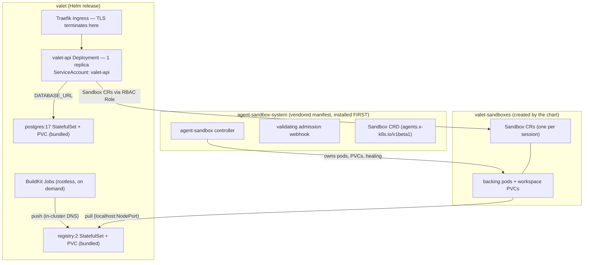

# Kubernetes Deployment Architecture

How Valet runs on Kubernetes, and the infra-level constraints you must
respect when deploying the cluster. The runbook for the local reference
environment (Rancher Desktop) is [`deploy/README.md`](../deploy/README.md).
The design rationale is
[`docs/specs/2026-07-15-kubernetes-deployment-design.md`](specs/2026-07-15-kubernetes-deployment-design.md).
This page is the map of what exists and what will break if you deviate.
For Valet-on-Valet dev (`make k8s-*` from inside a Valet sandbox), see
[`docs/valet-in-valet-dev.md`](valet-in-valet-dev.md).

## What Gets Deployed

Three namespaces with different owners:



- **`agent-sandbox-system`** — the vendored
  [agent-sandbox](https://agent-sandbox.sigs.k8s.io/) controller
  (`deploy/agent-sandbox/<version>/manifest.yaml`). Shared infrastructure,
  not part of the Helm release.
- **`valet`** — the Helm release (`deploy/chart/valet`): the API, bundled
  Postgres and OCI registry (both replaceable with external services),
  BuildKit jobs for prebuilt sandbox images, ingress.
- **`valet-sandboxes`** — where sessions live: one `Sandbox` CR per session,
  each backed by a pod and a workspace PVC managed by the controller.

## Topology and Ordering

### The API is a singleton (today)

`api.replicas` is pinned to 1 and must stay there for now. The engine keeps
in-memory state that has no cross-pod story yet: live event fan-out to
WebSockets, the per-process session cache, and the singleton pollers
(channel long-poll, idle sweep). With two replicas, clients miss events depending on which pod their
socket landed on. Restart tolerance comes from durability (boot-time
reconciliation over Postgres), not from redundancy, so there is no HPA
and no PodDisruptionBudget. This is a current limitation, not the end
state. See [Not Implemented Yet](#not-implemented-yet) for the path to
horizontal scaling.

### Install the agent-sandbox controller first

The chart assumes the `Sandbox` CRD (`agents.x-k8s.io/v1beta1`) and its
validating webhook already exist. There is no published Helm chart for agent-sandbox, and Helm's `crds/`
semantics (install once, never upgrade) cannot manage it. The release
manifest is therefore vendored and applied separately
(`make k8s-sandbox-install`, an idempotent server-side apply).
Version bumps are an explicit vendored-manifest update. The webhook's
Service and certs are part of the manifest: wait for its endpoints to be
ready before installing the chart, or CR creation will fail.

### Postgres must be ready before the API boots

The API runs schema migrations at boot. The Deployment has a `wait-for-postgres` initContainer that gates on the
bundled StatefulSet's readiness. Without it, the api crash-loops until
Postgres is up. If you swap in `externalDatabase.url`, the same
requirement transfers to you: the database must be reachable at pod
start. An api pod stuck in `Init:0/1` means Postgres is not ready.

## Networking and URLs

### `BETTER_AUTH_URL` must be `https://`

better-auth marks session cookies `Secure`. TLS terminates at the ingress
(Traefik, with a self-signed default cert locally and a real cert via
`ingress.tls.secretName` otherwise). But if the advertised URL is plain
`http`, login *silently* fails: the browser simply never sends the cookie
back. This is a values-level footgun (`api.betterAuthUrl`), not a code path
you'll see an error from.

### Sandboxes call the API on an in-cluster URL, not the public one

Sandbox pods run in a different namespace and must reach the API to
exchange git credentials and read memory. The chart's ConfigMap sets
`VALET_SANDBOX_API_URL` to the API Service's in-cluster DNS name
(`http://<release>-api.<ns>.svc.cluster.local:<port>`). Without it, the server falls back to the public `BETTER_AUTH_URL`. That
URL is generally *not* pod-reachable — it resolves at your ingress or
laptop, not inside the cluster — and in-sandbox git operations then fail
confusingly.

### Registry traffic is split: pull via NodePort, push via cluster DNS

The bundled `registry:2` serves prebuilt sandbox images, and its two client
paths resolve names differently:

- **Pull** (kubelet, pulling a sandbox pod's image): image refs use
  `localhost:<nodePort>` (default `30500`), because the node's kubelet
  resolves image registries per-node and **cannot resolve an in-cluster
  ClusterIP Service DNS name**. Hence the NodePort.
- **Push and retention** (BuildKit jobs, garbage collection): in-cluster
  Service DNS.

Swapping in `externalRegistry.url` collapses the split (one URL, TLS).
Known limitation: prebuild image retention wires no registry credentials,
so pruning is skipped against an external registry. Stale images
accumulate until you prune them out of band. An `externalRegistry.pullSecret`
(`dockerconfigjson` Secret, created out of band in the sandbox namespace) is
required for sandbox pods to pull from a private registry.

## Secrets

Leaving `api.secrets.*` blank makes the chart generate values on first
install and **retain them across `helm upgrade`** (a `lookup`-based guard in
`templates/secret.yaml`). This is not cosmetic. A naive regeneration of `BETTER_AUTH_SECRET` on
each upgrade would invalidate every user session *and* rotate the sandbox
JWT master (`VALET_SANDBOX_JWT_MASTER` falls back to
`BETTER_AUTH_SECRET`), which cuts off every running sandbox's terminal
and VS Code access. If you manage secrets externally, keep them stable for the
same reason. The bundled Postgres password follows the same retain pattern.

## Sandbox Lifecycle and Storage

### A separate namespace with exactly-scoped RBAC

Session sandboxes are deliberately placed in `valet-sandboxes`, separate
from the API's namespace, so the API's Role can be narrowly scoped there
instead of granting pod access next to its own pod. The Role grants:
`Sandbox` CRs create/get/list/watch/**update**/delete, plus
pods/`pods/exec`/`pods/log`. Nothing cluster-scoped — the controller owns
PVC management.

The `update` verb is not optional. The provider's create-is-upsert path
re-asserts an existing CR via HTTP PUT, which is exactly the
workspace-preserving re-provision path. If you omit the verb, 403s appear
only when a sandbox is *recovered* — the worst time to find out.

### The sandbox's identity is the CR, not the pod

The controller owner-references the workspace PVC to the `Sandbox` CR, so
**deleting a CR cascade-deletes the workspace**. The provider therefore
distinguishes two teardown paths:

- `release()` — a **no-op** that leaves the CR standing. Used for ordinary
  re-provisioning (liveness failure, engine restart): the subsequent
  upsert-`create` re-adopts the same CR, the controller heals a fresh pod
  onto the retained PVC, and files survive. Pod death is invisible plumbing.
- `destroy()` — terminal. Deletes the CR; the controller cascade-deletes
  pod and PVC. Reached only on actual session deletion.

Operational consequences:

- `kubectl delete pod` on a backing pod is **safe** — the controller heals
  it and the workspace survives (the deployment smoke test verifies exactly
  this).
- `kubectl delete sandbox` is **data loss** for that session's workspace.
- `helm uninstall` leaves both StatefulSet PVCs (Kubernetes design —
  `volumeClaimTemplates` PVCs are not release-owned) and any standing
  `Sandbox` CRs. A true reset requires the explicit deletes documented in
  `deploy/README.md`.

For anyone debugging: the backing pod's name is *not* in the CR status.
It lives in the `agents.x-k8s.io/pod-name` annotation, and the controller
mints a fresh pod name after recovery. The provider re-resolves it per
operation. So should you.

### Hibernation is a spec patch, not a delete

Kubernetes is the only backend with `capabilities().hibernation`. The API's idle sweep (`VALET_SANDBOX_IDLE_MINUTES`, default 30) suspends
idle sandboxes by patching the CR's `operatingMode: Suspended`. The
controller then scales the pod to zero while the CR and PVC remain. Waking patches it back
to `Running`. Interactive terminal/editor activity holds a sandbox awake.
Budget-wise this means idle sessions cost you a PVC, not a pod.

### Storage expectations

The chart uses the cluster's **default storage class** unless
`storageClassName` is set (Postgres 5 Gi, registry 10 Gi, sandbox
workspaces 2 Gi `ReadWriteOnce` each via the CR's `volumeClaimTemplates`).
A cluster with no default storage class leaves everything `Pending`.

## Images and Builds

### Prebuilt images come from in-cluster BuildKit jobs

Prebuilt sandbox images are built by `moby/buildkit:rootless` Jobs. The
defaults: 1–2 CPU / 2–4 Gi, `activeDeadlineSeconds: 1800` (a stuck build
is killed, not left running), and an in-process concurrency cap of 1
(extra builds queue FIFO). If you enable prebuilds, size node capacity
accordingly.

### Published images: GHCR on every dev-v2 merge

CI (`.github/workflows/docker-publish.yml`) publishes both deployable
images to GHCR as public multi-arch (amd64 + arm64) manifests on every
merge to `dev-v2` and on version tags:

- `ghcr.io/<owner>/valet-api` — the api with the web SPA baked in
- `ghcr.io/<owner>/valet-sandbox` — the session sandbox pod image

Each publish carries a moving branch tag (`dev-v2`) and an immutable
`sha-<shortsha>` tag. **Deploy the sha tag.** The chart defaults to
`imagePullPolicy: IfNotPresent`, so a moving tag silently goes stale on any
node that has pulled it before:

```bash
helm upgrade ... \
  --set api.image.repository=ghcr.io/<owner>/valet-api \
  --set api.image.tag=sha-<shortsha> \
  --set sandbox.image.repository=ghcr.io/<owner>/valet-sandbox \
  --set sandbox.image.tag=sha-<shortsha>
```

The images are public, so no pull secrets are needed (`api.imagePullSecrets`
exists for private mirrors).

### Local image visibility is a moby-mode trick — it doesn't generalize

Locally, `make k8s-build` uses plain `docker build`, and the images are
visible to pods *only because* Rancher Desktop's moby mode backs k3s with
cri-dockerd (the chart pins concrete tags with
`imagePullPolicy: IfNotPresent`, so no pull is attempted). Any remote or
multi-node cluster should use the GHCR images above instead.

## Not Implemented Yet

These are on the roadmap but not built. Plan deployments around their
absence today rather than assuming them:

- **Horizontal API scaling** (HPA, PDBs). The singleton is a v1
  simplification, not the end state. The durable substrate was built for
  distribution: submissions are CAS-claimed with leases and expiry
  takeover, settlement is write-fenced, the event log is
  offset-addressed, and workflow runs carry owner leases. What is missing
  is the coordination layer on top: cross-pod event wake-up (the live
  fan-out in `PgEventStream` is in-process only, and Postgres
  `LISTEN/NOTIFY` is the natural fix), per-session ownership (sticky
  routing or a session lease), and leader election for the singleton
  pollers (channel long-poll, idle sweep, workflow host). No schema
  changes are required. Until then, note that the API pod is
  orchestration, not compute — sandboxes already scale out per-session.
  One replica is therefore an availability constraint (a brief blip on
  rollout) more than a throughput one.
- **Network policies and pod security admission hardening** beyond the
  namespace split; gVisor/Kata runtime classes for sandbox pods are
  likewise prod-hardening follow-ups.
- **Remote-cluster deploy automation** — CI publishes the images (see
  [Images and Builds](#images-and-builds)), but rolling them out to a
  cluster is still a manual `helm upgrade`.
- **Operator-managed Postgres** (e.g. CloudNativePG) — the supported prod
  path is `externalDatabase.url` pointing at managed Postgres.
- **agent-sandbox warm pools** (`SandboxWarmPool`) — the fast-follow that
  would cut cold starts; not wired yet.
- **Credentialed registry retention** — see the registry section above.

## Quick Reference

| Thing | Value / location |
|-------|------------------|
| Chart | `deploy/chart/valet` (api port 8787, Service :80, Traefik ingress) |
| Controller manifest | `deploy/agent-sandbox/<version>/manifest.yaml` |
| Sandbox CRD | `agents.x-k8s.io/v1beta1`, kind `Sandbox`, label `valet.dev/session-id` |
| Namespaces | `valet` (release), `valet-sandboxes` (sessions), `agent-sandbox-system` (controller) |
| Backend switch | `VALET_SANDBOX_BACKEND=kubernetes` (set by the ConfigMap) |
| Make targets | `k8s-sandbox-install`, `k8s-build`, `k8s-up`, `k8s-logs`, `k8s-down` |
| Smoke test | Helm test Job curling `/api/health` |
