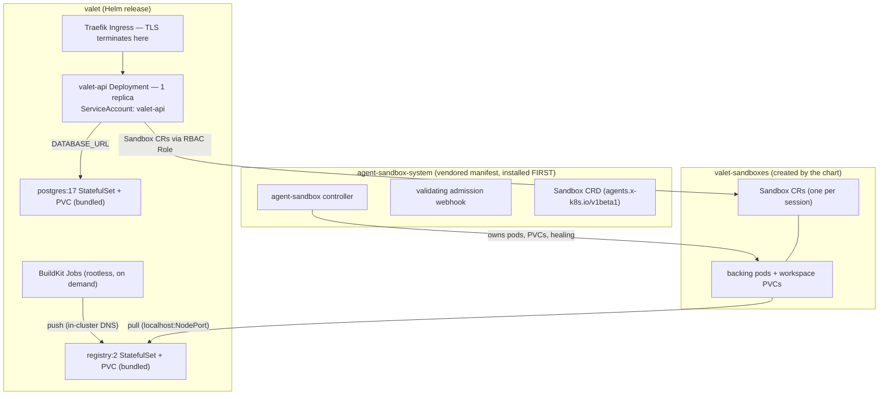

# Kubernetes Deployment Architecture

How Valet runs on Kubernetes, and — most importantly — the infra-level
constraints you must respect when deploying the cluster. The practical
runbook for the local reference environment (Rancher Desktop) is
[`deploy/README.md`](../deploy/README.md); the design rationale is
[`docs/specs/2026-07-15-kubernetes-deployment-design.md`](specs/2026-07-15-kubernetes-deployment-design.md).
This page is the map of what exists and what will break if you deviate.

## What Gets Deployed

Three namespaces with different owners:

- **`agent-sandbox-system`** — the vendored
  [agent-sandbox](https://agent-sandbox.sigs.k8s.io/) controller
  (`deploy/agent-sandbox/<version>/manifest.yaml`). Shared infrastructure,
  not part of the Helm release.
- **`valet`** — the Helm release (`deploy/chart/valet`): the API, bundled
  Postgres and OCI registry (both replaceable with external services),
  BuildKit jobs for prebuilt sandbox images, ingress.
- **`valet-sandboxes`** — where sessions live: one `Sandbox` CR per session,
  each backed by a pod and a workspace PVC managed by the controller.

## Hard Constraints

These are load-bearing. Each one was either designed in deliberately or
discovered the hard way; the chart encodes them, and overriding them breaks
the system in non-obvious ways.

### 1. The API is a singleton — never scale past 1 replica

`api.replicas` is pinned to 1. The engine keeps in-memory state that has no
cross-pod story: the submission claim loop, WebSocket fan-out, and the
per-process session cache. There is no leader election. Running 2 replicas
means two engines claiming the same durable submissions and clients missing
events depending on which pod their socket landed on. Restart tolerance
comes from durability (boot-time reconciliation over Postgres), not from
redundancy. No HPA, no PodDisruptionBudget — by design for now.

### 2. Install order: agent-sandbox controller before the chart

The chart assumes the `Sandbox` CRD (`agents.x-k8s.io/v1beta1`) and its
validating webhook already exist. There is no published Helm chart for
agent-sandbox, and Helm's `crds/` semantics (install-once, never upgraded)
can't manage it — so the release manifest is vendored and applied
separately (`make k8s-sandbox-install`, idempotent server-side apply).
Version bumps are an explicit vendored-manifest update, and the webhook's
Service/certs are part of it — wait for webhook endpoints to be ready
before installing the chart, or CR creation will fail.

### 3. Boot ordering: Postgres must be ready before the API starts

The API runs schema migrations at boot. The Deployment has a
`wait-for-postgres` initContainer gating on the bundled StatefulSet's
readiness — without it the api crash-loops until PG is up. If you swap in
`externalDatabase.url`, the same requirement transfers to you: the database
must be reachable at pod start. An api pod stuck in `Init:0/1` means
Postgres isn't ready.

### 4. `BETTER_AUTH_URL` must be `https://`

better-auth marks session cookies `Secure`. TLS terminates at the ingress
(Traefik; self-signed default cert locally, real cert via
`ingress.tls.secretName` otherwise) — but if the advertised URL is plain
`http`, login *silently* fails: the browser simply never sends the cookie
back. This is a values-level footgun (`api.betterAuthUrl`), not a code path
you'll see an error from.

### 5. Secrets are generate-and-retain — do not let them rotate

Leaving `api.secrets.*` blank makes the chart generate values on first
install and **retain them across `helm upgrade`** (a `lookup`-based guard in
`templates/secret.yaml`). This is not cosmetic: naively regenerating
`BETTER_AUTH_SECRET` on each upgrade would invalidate every user session
*and* rotate the sandbox JWT master (`VALET_SANDBOX_JWT_MASTER` falls back
to `BETTER_AUTH_SECRET`), cutting off every running sandbox's terminal and
VS Code access. If you manage secrets externally, keep them stable for the
same reason. The bundled Postgres password follows the same retain pattern.

### 6. Sandboxes live in their own namespace, and the RBAC verbs are exact

Session sandboxes are deliberately placed in `valet-sandboxes`, separate
from the API's namespace, so the API's Role can be narrowly scoped there
instead of granting pod access next to its own pod. The Role grants:
`Sandbox` CRs create/get/list/watch/**update**/delete, plus
pods/`pods/exec`/`pods/log`. Nothing cluster-scoped — the controller owns
PVC management. The `update` verb is not optional: the provider's
create-is-upsert path re-asserts an existing CR via HTTP PUT, which is
exactly the workspace-preserving re-provision path. Omitting it produces
403s only when a sandbox is *recovered*, which is the worst time to find
out.

### 7. The sandbox's identity is the CR, not the pod — and teardown has two distinct paths

The controller owner-references the workspace PVC to the `Sandbox` CR, so
**deleting a CR cascade-deletes the workspace**. The provider therefore
distinguishes:

- `release()` — a **no-op** that leaves the CR standing. Used for ordinary
  re-provisioning (liveness failure, engine restart): the subsequent
  upsert-`create` re-adopts the same CR, the controller heals a fresh pod
  onto the retained PVC, and files survive. Pod death is invisible plumbing.
- `destroy()` — terminal. Deletes the CR; controller cascade-deletes pod +
  PVC. Reached only on actual session deletion.

Operational consequences: `kubectl delete pod` on a backing pod is safe (the
controller heals it, workspace intact) — the exit-criteria dogfood verifies
exactly this. `kubectl delete sandbox` is **data loss** for that session's
workspace. And `helm uninstall` leaves both StatefulSet PVCs (Kubernetes
design — `volumeClaimTemplates` PVCs aren't release-owned) and any standing
`Sandbox` CRs; a true reset requires the explicit deletes documented in
`deploy/README.md`.

One more subtlety for anyone debugging: the backing pod's name is *not* in
the CR status — it's in the `agents.x-k8s.io/pod-name` annotation, and the
controller mints a fresh pod name after recovery. The provider re-resolves
it per operation; so should you.

### 8. Registry networking is split: pull via NodePort, push via cluster DNS

The bundled `registry:2` serves prebuilt sandbox images, and its two client
paths resolve names differently:

- **Pull** (kubelet, pulling a sandbox pod's image): image refs use
  `localhost:<nodePort>` (default `30500`), because the node's kubelet
  resolves image registries per-node and **cannot resolve an in-cluster
  ClusterIP Service DNS name**. Hence the NodePort.
- **Push + retention** (BuildKit jobs, garbage collection): in-cluster
  Service DNS.

Swapping in `externalRegistry.url` collapses the split (one URL, TLS) but
comes with a known limitation: prebuild image retention wires no registry
credentials, so pruning is skipped against an external registry — stale
images accumulate until pruned out of band. An `externalRegistry.pullSecret`
(`dockerconfigjson` Secret, created out of band in the sandbox namespace) is
required for sandbox pods to pull from a private registry.

### 9. Sandboxes call the API on an in-cluster URL, not the public one

Sandbox pods run in a different namespace and must reach the API to
exchange git credentials and read memory. The chart's ConfigMap sets
`VALET_SANDBOX_API_URL` to the API Service's in-cluster DNS name
(`http://<release>-api.<ns>.svc.cluster.local:<port>`). Without it, the
server falls back to the public `BETTER_AUTH_URL` — which is generally
*not* pod-reachable (it resolves at your ingress/laptop, not inside the
cluster), and things like in-sandbox git operations fail confusingly.

### 10. Hibernation exists only here — and it's a spec patch, not a delete

Kubernetes is the only backend with `capabilities().hibernation`. The API's
idle sweep (`VALET_SANDBOX_IDLE_MINUTES`, default 30) suspends idle
sandboxes by patching the CR's `operatingMode: Suspended` — the controller
scales the pod to zero while the CR and PVC remain. Waking patches it back
to `Running`. Interactive terminal/editor activity holds a sandbox awake.
Budget-wise this means idle sessions cost you a PVC, not a pod.

### 11. Image builds run as in-cluster BuildKit jobs with a hard deadline

Prebuilt sandbox images are built by `moby/buildkit:rootless` Jobs:
default 1–2 CPU / 2–4 Gi, `activeDeadlineSeconds: 1800` (a stuck build is
killed, not left running), and an in-process concurrency cap of 1 (extra
builds queue FIFO). Size node capacity accordingly if you enable prebuilds.

### 12. Reference-environment image visibility is a moby-mode trick

Locally, `make k8s-build` uses plain `docker build`, and the images are
visible to pods *only because* Rancher Desktop's moby mode backs k3s with
cri-dockerd (the chart pins concrete tags with `imagePullPolicy:
IfNotPresent`, so no pull is attempted). This does not generalize: any
remote or multi-node cluster needs images pushed to a real registry — CI
publishing is a recorded follow-up, so today that's a manual step for a
non-local deploy.

### 13. Storage expectations

The chart uses the cluster's **default storage class** unless
`storageClassName` is set (Postgres 5 Gi, registry 10 Gi, sandbox
workspaces 2 Gi `ReadWriteOnce` each via the CR's `volumeClaimTemplates`).
A cluster with no default storage class leaves everything `Pending`.

### 14. Context safety when operating clusters (binding rule)

Developer machines' ambient kubectl context may point at a production
cluster. Every `make k8s-*` target and every documented command pins
`--context rancher-desktop` (`--kube-context` for helm). Never run a bare
`kubectl`/`helm` against this workflow — pin the context explicitly,
always.

## What Is Deliberately NOT Handled Yet

Recorded non-goals — plan around them rather than assuming them:

- **Horizontal API scaling** (HPA, PDBs, leader election) — see constraint 1.
- **Network policies and pod security admission hardening** beyond the
  namespace split; gVisor/Kata runtime classes for sandbox pods likewise
  (prod-hardening follow-ups).
- **CI image publishing / remote-cluster automation** — the pipeline ends at
  the local reference environment today.
- **Operator-managed Postgres** (e.g. CloudNativePG) — the supported prod
  path is `externalDatabase.url` pointing at managed Postgres.
- **agent-sandbox warm pools** (`SandboxWarmPool`) — the fast-follow that
  would cut cold starts; not wired yet.
- **Credentialed registry retention** — see constraint 8.

## Quick Reference

| Thing | Value / location |
|-------|------------------|
| Chart | `deploy/chart/valet` (api port 8787, Service :80, Traefik ingress) |
| Controller manifest | `deploy/agent-sandbox/<version>/manifest.yaml` |
| Sandbox CRD | `agents.x-k8s.io/v1beta1`, kind `Sandbox`, label `valet.dev/session-id` |
| Namespaces | `valet` (release), `valet-sandboxes` (sessions), `agent-sandbox-system` (controller) |
| Backend switch | `VALET_SANDBOX_BACKEND=kubernetes` (set by the ConfigMap) |
| Make targets | `k8s-sandbox-install`, `k8s-build`, `k8s-up`, `k8s-logs`, `k8s-down` |
| Smoke test | Helm test Job curling `/api/health` |
