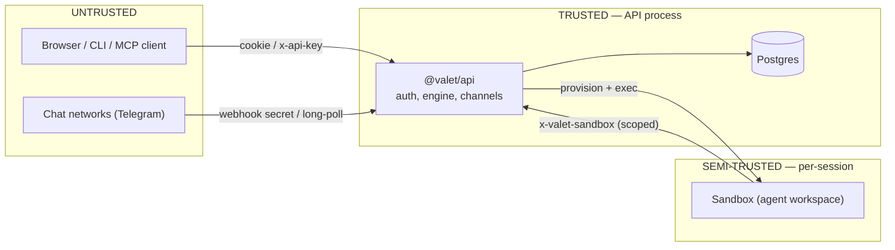

# Security Model

Trust boundaries, authentication and authorization mechanisms, and data
protection in Valet.

## Trust Boundaries

- **The API process is the trust root.** It holds the database, all
  credentials, and the auth secrets. Everything else authenticates to it.
- **Sandboxes are semi-trusted.** They run agent-authored code, so anything
  inside one is assumed compromisable. A sandbox holds no user credentials —
  only narrowly-scoped tokens for calling back into the API.
- **Clients and chat networks are untrusted.** Every request is
  authenticated and scoped to the caller's identity.

## Authentication

Requests to `/api/*` resolve through a strict priority ladder
(`packages/api/src/middleware/auth.ts`):

| # | Mechanism | Who | Scope |
|---|-----------|-----|-------|
| 1 | `x-valet-internal` | The server calling itself (orchestrator tools) | Full, in-process only |
| 2 | `x-valet-sandbox` | Sandboxes | **Only** `/api/memory` and `/api/sandbox`; 403 anywhere else, 401 if invalid |
| 3 | Session cookie | Browsers via better-auth | The signed-in user |
| 4 | `x-api-key` | CLI / automation (`vlt_` prefix, hashed at rest) | The key's user |
| 5 | Local stub | `VALET_LOCAL_AUTH=1` dev only | Fixed local identity |

Real auth is [better-auth](https://better-auth.com): email/password, optional
Google/GitHub social login, and generic OIDC SSO (PKCE). The first signup
becomes org admin; invite codes are stored hashed. Signup can be restricted
by email domain (`AUTH_ALLOWED_EMAIL_DOMAINS`).

**MCP** (`/mcp`) uses proper OAuth instead of API keys: RFC 8414 discovery,
dynamic client registration, and Bearer access tokens validated against the
better-auth OAuth tables. Tools are scoped to the token's user.

## Authorization

- **Org roles:** `org_members.role` is `admin | member`. Admin gates org
  settings, invites, LLM provider keys, the GitHub App, image
  catalog/prebuilds, and the `/api/admin` surface.
- **Session ownership:** session routes (including the WebSocket and the
  gateway proxy) verify the session belongs to the caller; non-owners get 404.
- **Channel identity:** inbound chat messages only act for a user after an
  explicit link (`/start <code>` deep-link; codes are stored hashed in
  `identity_link_codes`, links in `user_identity_links`).

## Sandbox Isolation

Each session's sandbox is provisioned with exactly five environment values —
and no user credentials:

| Variable | Purpose |
|----------|---------|
| `VALET_SANDBOX_TOKEN` | Bearer for calling back into the API — hashed at rest, revocable, and only accepted on the memory and git-credential routes |
| `VALET_SANDBOX_JWT_SECRET` | Per-session secret, derived from a master key (`HMAC-SHA256(master, sessionId)`) — never the master itself |
| `VALET_SESSION_ID` / `VALET_SANDBOX_PROFILE` / `VALET_API_URL` | Identity + callback address |

Consequences:

- **Git access without stored credentials.** The in-sandbox git credential
  helper exchanges `VALET_SANDBOX_TOKEN` for a short-lived token via
  `/api/sandbox/git-credential` at fetch/push time. Nothing durable lives in
  the sandbox filesystem.
- **Interactive services are doubly gated.** The terminal (ttyd) and VS Code
  (code-server) inside a `full` sandbox sit behind an in-sandbox gateway
  (`:9000`) that only accepts HS256 JWTs signed with that session's derived
  secret **and** whose `sid` claim equals its own `VALET_SESSION_ID` — a JWT
  minted for one session is rejected inside another even with a valid
  signature. The browser never talks to the sandbox directly: it goes through
  the API's proxy (`/api/sessions/:id/gateway/*`), which independently checks
  session ownership before forwarding.
- **On Kubernetes, sandboxes live in their own namespace**
  (`valet-sandboxes`) and the API's service account holds only the narrow
  role needed there (Sandbox CRs, `pods/exec`, `pods/log`).
- The `local` sandbox backend has **no isolation** (host fs/processes) and is
  for dev/test only.

## Tool-Call Safety

Tool and action definitions carry a `riskLevel` (`low → critical`) and may
require approval. Approvals, questions, and credential requests are durable
**decision gates**: the turn suspends until a human resolves the gate from
the web UI, CLI, or a linked chat channel. Gates expire on a timer and
survive restarts — an approval can never be lost or implicitly granted by a
crash.

## Data Protection

| Data | Protection |
|------|-----------|
| Integration credentials (`credentials` table) | AES-256-GCM encrypted columns (`VALET_ENCRYPTION_KEY`) |
| GitHub App installation tokens | Encrypted, cached with expiry |
| API keys, sandbox tokens, invite codes, identity-link codes | Stored as hashes only |
| Auth secrets in Kubernetes | Chart-generated and retained as k8s Secrets when not supplied |
| LLM keys | Org-level `llm_providers` rows (encrypted), or server env |

Session transcripts, memory files, and events live in Postgres under the org;
blob attachments live in the blob store (`~/.valet/blobs` by default).

## Webhook Verification

- **GitHub App** (`/webhooks/github-app`): HMAC signature verification.
- **Channel webhooks** (`/api/channels/:type/webhook`): per-registration
  random secret checked by the transport (Telegram's
  `X-Telegram-Bot-Api-Secret-Token`); with no public URL configured, channels
  fall back to long-polling and expose no inbound endpoint at all.
- **Plugin triggers**: each `TriggerDef` verifies raw bytes against its
  service's scheme before any parsing.

## Operational Notes

- `VALET_TEST_AUTH_HEADER` (test impersonation) must never be set in dev
  targets, `.env`, or any deployed environment.
- The API serves one process per deployment; there is no multi-tenant
  cross-org surface — the data model is single-org.
