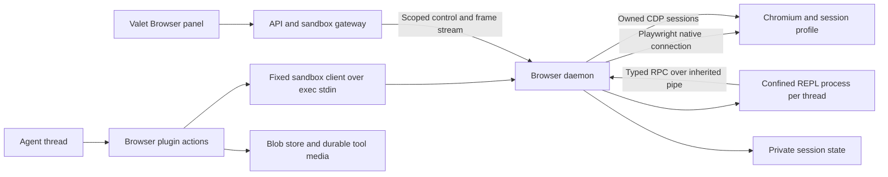

# Sandbox browser design

Status: implemented first release. Section 16 records the delivered behavior and remaining capability limits.
Date: 2026-09-23, America/Los_Angeles.
Research: [harness observations and source notes](../research/2026-09-23-browser-harness.md).

## 1. Outcome

Valet gives each session a real Chromium browser inside its sandbox. Agents control
that browser through a persistent JavaScript interface. People view the same tabs
in Valet and can interact alongside the agent. The browser can reach development servers in its
own sandbox and authorized external websites.

The interface supports three observations: an accessibility snapshot, a DOM
snapshot, and an image. An agent chooses the observation that answers its next
question. A screenshot reaches the model as image content, not as a filename.

Implement the externally useful Codex browser contract. Do not depend on Codex
internals, reproduce its undocumented implementation, or promise every declared
method works on every backend. The research found declared methods that the
connected Codex browser rejected.

### Defaults

- One browser profile belongs to one Valet session. Sibling threads share that
  profile, with explicit tab ownership and serialized mutations.
- One JavaScript REPL belongs to one thread and one browser runtime generation.
- Cookies and website storage persist with the session. REPL variables and DOM
  handles are ephemeral.
- Chromium runs headless. The web client displays page pixels and supplies its
  own tab strip, address bar, dialog controls, and download controls.
- Browser automation works in headless and full sandbox profiles. Viewing is a
  separate capability; it does not require Terminal or VS Code.
- Docker and Kubernetes are production targets. The local provider requires
  explicit configuration. The virtual provider supplies a contract-test fake.
- Existing shell browser workflows remain a temporary compatibility option.
  They must not attach to or mutate the new managed browser profile.

These defaults require no shared personal sign-in service. Shared user profiles,
team profiles, and profile transfer are separate future designs.

### Scope and parity

| Surface | Required behavior | Delivery |
| --- | --- | --- |
| Persistent scripting | Bindings, top-level await, structured output, reset, cancellation | Core |
| Browser and tab discovery | List, create, bind, navigate, reload, close, ownership marks | Core |
| Accessibility | Roles, names, values, states, references, full/diff output | Core |
| Visual observation | Viewport/full-page/cropped images with coordinate metadata | Core |
| DOM and locators | Playwright-style locators, frames, text and attribute reads | Core |
| Interaction | Click, drag, hover, scroll, keys, fill, paste, check, select | Core |
| Human viewer | Page stream, navigation controls, explicit takeover and release | Core |
| Lifecycle | Profile persistence, restart generations, safe operation recovery | Core |
| Files and dialogs | Downloads, authorized uploads, JS dialogs, content export | Complete parity |
| Diagnostics | Console logs, bounded network metadata, optional traces | Complete parity |
| Page tools | Capability-discovered WebMCP tools with per-call policy | Complete parity, conditional on browser support |
| Page assets | Observed asset inventory and bounded export | Complete parity |
| History and clipboard | Session-local history and clipboard with explicit access | Complete parity |
| Viewport and visibility | Explicit dimensions; display selected tab in Valet | Core |
| Annotations | Screenshot region/element feedback tied to an observation | Complete parity |
| Native desktop control | OS apps, native dialogs, full desktop video | Out of scope |
| User browser extensions | Connect to personal Chrome or Edge on a user's computer | Out of scope |
| General CDP passthrough | Arbitrary browser internals or debugger access | Deferred privileged feature |
| Product-specific exports | Google Workspace conversion and YouTube transcripts | Optional adapters, not core browser methods |

“Complete parity” is a required later increment of this design. It is not a
claim that the first release includes those capabilities. The API advertises only
the capabilities that the installed runtime implements and its policy permits.

## 2. Current Valet foundation

The v2 browser plugin registers a skill. That skill calls `agent-browser`, which
is installed with apt Chromium in the sandbox image. There is no managed browser
service, persistent model-facing REPL, or web browser panel.

Reuse these paths:

| Existing component | Reuse | Required change |
| --- | --- | --- |
| `packages/plugin-browser` | Plugin manifest and browser skill | Typed actions and runtime client |
| `packages/engine/src/plugin-catalog.ts` | Action discovery, validation, audit and policy | Stable invocation identity; operation-level authorization seam |
| `packages/engine/src/sandbox/policy.ts` | Lazy sandbox readiness and failure reporting | Preserve non-retry behavior for browser mutations |
| `packages/sandbox-gateway` | Session-bound HTTP/WS gateway | Browser scopes and explicit viewer routes |
| `packages/api/src/routes/gateway-proxy.ts` | Auth stripping, proxying, binary WS transport | Browser ticket validation, revocation, activity classification |
| `packages/web/src/components/session/sandbox-tabs.tsx` | Session pane placement | Browser pane based on runtime capabilities, independent of `full` |
| Docker/Kubernetes providers | Sandbox lifecycle and durable mounts | Durable adoption, private runtime-state mount, browser process resources |
| `ToolAttachment` and `tool-bridge.ts` | Immediate model image content | Durable media references, live/REST rendering and rehydration |

Three existing behaviors require deliberate integration:

1. `ToolDef.requiresApproval` does not enforce approval. Use the action policy
   path and `ctx.requestDecision()` where appropriate.
2. The engine can re-invoke a blocked tool from its beginning after restart.
   Browser execution must attach to an existing cell, never rerun it blindly.
3. Clean sandbox suspend/resume can retain the attachment epoch. A separate
   browser runtime ID must invalidate browser and REPL handles.

No work targets the frozen worker/client/runner stack.

## 3. Architecture and software decisions



### Chosen stack

| Area | Decision | Reason |
| --- | --- | --- |
| Browser control | `playwright-core` 1.63.0 with its matching Chromium build | Stable public AI snapshot APIs; reliable locators and frame support |
| Browser installation | Install the browser revision specified by that exact Playwright release | Avoid apt Chromium and client version drift |
| Process ownership | Daemon launches a persistent context and retains the Playwright connection | Avoid the documented lower fidelity of `connectOverCDP` as the main connection |
| Low-level features | `browserContext.newCDPSession(page)` inside the daemon | Accessibility fallback, screencast and selected diagnostics |
| JavaScript cells | Node 22 LTS `node:repl`, one confined subprocess per thread | Persistent bindings and top-level await without writing a JavaScript compiler |
| REPL confinement | Bubblewrap namespaces, a minimal mount view and a reviewed seccomp policy | A real OS boundary around the scripting process |
| Control protocol | Versioned typed JSON messages; binary frames and attachments on separate channels | Explicit validation, cancellation, quotas and compatibility |
| Runtime journal | SQLite through a pinned `better-sqlite3` build | Transactional operation receipts and a single local owner |
| Human display | CDP screencast through authenticated WebSockets to a React canvas | Works with headless Chromium and the existing gateway |
| Schemas | Existing TypeBox/JSON Schema conventions | Reuse Valet validation and model tool schemas |
| Browser guidance | Versioned base and advanced skills plus runtime-generated API reference | Instructions stay aligned with installed capabilities |

Playwright 1.63.0 and Chromium revision 1243 were verified during research. Do not
use a floating `latest` image or silently change the system browser. Resolve and
lock the remaining dependencies during the first build spike. Record Node,
Playwright, Chromium, SQLite binding, image digest and protocol versions in the
runtime manifest and SBOM. Validate amd64 and arm64 images separately.

### Alternatives considered

**Extend agent-browser.** This offers the smallest initial change and already
supports many actions. Its CLI contract does not supply the proposed Valet
ownership, REPL, approval continuation, transcript media, and human-control
contracts. Keep it as a migration path. Do not maintain two controllers for the
same managed profile.

**Use Playwright MCP as the browser server.** Its tools and snapshot approach are
useful references. The researched latest MCP package depends on a Playwright
alpha. Its product contract does not replace Valet session ownership, persistent
cells, viewer authorization, or durable operation receipts. Use stable public
Playwright APIs directly. Keep any adapted code under its required license.

**Use a headed browser with Xvfb and noVNC.** This is suitable for full desktop
interaction and native browser chrome. It adds a display server, desktop input,
and another control path. Choose headless page streaming for this browser scope.
If native UI becomes a requirement, design it as an additional backend.

**Use QuickJS for cells.** It exposes fewer host capabilities, but its async API
does not provide persistent top-level-await REPL semantics by itself. A binding
store and compiler transform would become Valet code to maintain. Prefer the
Node REPL for this interface. Confinement is an OS responsibility, not `node:vm`.

## 4. Packages and ownership

Add `packages/browser-runtime`, built into the sandbox image. It owns the daemon,
client executable, browser adapter, REPL child, snapshots, policy enforcement
hooks, operation journal, file transfers and viewer protocol. It does not import
`api`, `web`, or a plugin.

Add browser wire types to `packages/shared/src/browser/`. Keep transport-neutral
schemas and errors there. Node code and Playwright stay out of `shared`.

Extend `packages/plugin-browser` with `browser.execute`, `browser.reset`, and
`browser.describe`. Pin these through the existing plugin action path. They use
a fixed installed client command with JSON on stdin; never interpolate model
code or URLs into shell commands. The client uses a local Unix socket and returns
framed events and attachment references. The socket is not a public CDP endpoint.
The plugin registers `browser` for the required workflow and policy rules. It
registers `browser-advanced` for complex locators, frames, multi-tab flows,
asynchronous pages, file transfer, diagnostics, and recovery. The base skill
directs the agent to load the advanced skill when those conditions apply.

The API owns user authorization, policy resolution, decision gates, durable media,
browser tickets and metadata exposed to the web client. The daemon owns browser
state and scheduling. The portable engine owns only general invocation identity,
tool suspension and media contracts.

Create an injected `BrowserPolicyService` contract where the plugin needs host
policy decisions. Do not let the plugin import API policy or database code.
The SDK can hold the contract; the API supplies its implementation at assembly.

### Proposed file map

| Path | Responsibility |
| --- | --- |
| `packages/shared/src/browser/protocol.ts` | Commands, events, identity and error schemas |
| `packages/shared/src/browser/capabilities.ts` | Method registry and capability status |
| `packages/browser-runtime/src/daemon.ts` | Runtime ownership and service lifecycle |
| `packages/browser-runtime/src/client.ts` | Fixed stdin/stdout client for sandbox exec |
| `packages/browser-runtime/src/repl/` | Confined child, SDK proxy and cell protocol |
| `packages/browser-runtime/src/browser/` | Playwright lifecycle and locator adapter |
| `packages/browser-runtime/src/observations/` | Snapshot refs, diffs, immutable DOM and screenshots |
| `packages/browser-runtime/src/journal/` | SQLite cells and operation receipts |
| `packages/browser-runtime/src/control/` | Mutation lease, cancellation and human handoff |
| `packages/browser-runtime/src/viewer/` | Frame stream and input mapping |
| `packages/browser-runtime/src/files/` | Upload, download and export broker |
| `packages/browser-runtime/src/egress/` | Browser namespace and approved proxy path |
| `packages/plugin-browser/src/actions.ts` | Execute, reset and describe actions |
| `packages/sdk/src/browser-policy.ts` | Injected host policy contract |
| `packages/api/src/services/browser-policy.ts` | Actor, scope, origin and operation authorization |
| `packages/api/src/routes/browser.ts` | Status, grants, viewer tickets and control endpoints |
| `packages/web/src/components/session/browser/` | Browser panel and annotation controls |
| `packages/web/src/components/session/tool-renderers/browser.tsx` | Durable browser results and evidence |
| `scripts/e2e/suites/browser.ts` | Real runtime and recovery scorecard suite |

These are proposed new paths. Modify the existing engine context/bridge, API
assembly/wire/schema, gateway, provider manifests, image scripts and root build
references at the integration points listed above. Generate the plugin registry
with `make generate-registries`; do not hand-edit generated files.

### Initial host transport

`Sandbox.exec()` returns buffered output; it is not a bidirectional streaming
channel. The fixed client therefore implements `submit`, `events`, `resolve`,
`cancel` and `export` requests. Each receives schema-validated JSON on stdin and
returns a bounded JSON event batch. `submit` is idempotent by invocation ID.
`events` reads after a cursor and may wait at most five seconds. The daemon owns
execution between client calls. No exec process waits through a long approval.

The plugin translates event batches into host progress, decision requests and
final tool content. An event gap requires a status/receipt lookup, not cell replay.
Where the model adapter lacks incremental tool-result output, emit progress
separately and return the ordered content at completion.

For media, the file broker exports an authorized artifact to a dedicated transfer
directory readable by the sandbox client. The host uses the existing
`Sandbox.readBinary()` contract, verifies the recorded size/hash, stores the blob
and acknowledges transfer cleanup. It never asks the built-in text `read` tool to
decode a screenshot. Large file downloads use the streaming API route instead.

## 5. Agent-facing contract

### Model tools

```ts
type BrowserExecuteInput = {
  code: string;
  title: string;
  timeout_ms?: number;
};

type BrowserResetInput = { reason?: string };
type BrowserDescribeInput = { topic?: string };
```

The host supplies session ID, thread ID, queue item ID, invocation ID and policy
context. The model cannot choose another session or impersonate an actor through
tool parameters. `title` is display text and cannot authorize an operation.

`browser.execute` compiles and starts a cell, or attaches to the cell already
created for that invocation. It streams text, image references, progress and
policy requests. The tool returns ordered text/image/file content and a typed
terminal status. Successful execution alone does not mean the user's page task
succeeded; the agent must inspect the resulting state.

`browser.reset` cancels the thread's current cell and replaces its REPL process.
It preserves browser tabs, cookies and profile state. A separate user-facing
browser restart closes Chromium and changes the browser runtime ID.

`browser.describe` returns the protocol version, available methods, capability
states, limits and requested documentation topic. Initial connection emits a
short reference once per REPL generation. Detailed docs load on demand.

### JavaScript facade

Expose `browser` and `output`, with a compatibility alias `cua` for browser
entry points. Native app methods are absent.

```js
const tab = await browser.tabs.new({ url: "http://localhost:5173" });
await tab.getAXState(); // Emits an observation and returns its text.
await tab.playwright.getByRole("button", { name: "Save", exact: true }).click();
await tab.getAXState();
await tab.getScreenshot(); // Emits model-visible image content.
```

```ts
interface BrowserFacade {
  tabs: {
    list(): Promise<TabInfo[]>;
    get(id: string): Promise<Tab>;
    new(options?: { url?: string }): Promise<Tab>;
    selected(): Promise<Tab | undefined>;
  };
  capabilities: CapabilityCollection;
  documentation(topic?: string): Promise<string>;
  history(options: HistoryQuery): Promise<HistoryEntry[]>;
}

interface Tab {
  readonly id: string;
  goto(url: string): Promise<void>;
  back(): Promise<void>;
  forward(): Promise<void>;
  reload(): Promise<void>;
  close(): Promise<void>;
  title(): Promise<string>;
  url(): Promise<string>;
  getAXState(options?: ObservationOptions): Promise<string>;
  getScreenshot(options?: ScreenshotOptions): Promise<ImageHandle>;
  getAXStateAndScreenshot(options?: ObservationOptions): Promise<Observation>;
  click(target: ElementRef | Point, options?: ClickOptions): Promise<void>;
  hover(target: ElementRef | Point): Promise<void>;
  drag(from: Point, to: Point): Promise<void>;
  scroll(target: ElementRef | Point, direction: Direction, pages?: number): Promise<void>;
  setValue(target: ElementRef, value: string): Promise<void>;
  selectText(target: ElementRef, text: string, options?: SelectTextOptions): Promise<void>;
  performSecondaryAction(target: ElementRef, action: string): Promise<void>;
  typeText(target: ElementRef | null, text: string): Promise<void>;
  paste(target: ElementRef | null, text: string, options?: PasteOptions): Promise<void>;
  pressKey(target: ElementRef | null, key: string): Promise<void>;
  getJsDialog(): Promise<Dialog | undefined>;
  markDeliverable(): Promise<void>;
  markHandoff(): Promise<void>;
  playwright: PlaywrightFacade;
  dev: DiagnosticFacade;
  content: ContentFacade;
  clipboard: ClipboardFacade;
  capabilities: CapabilityCollection;
}
```

The source schema must define every referenced type before implementation. This
document's tables specify their required behavior. Do not infer unspecified
methods from stock Playwright. A generated method registry is the authority for
SDK dispatch, validation, documentation and contract tests.

Observation methods emit by default and support `emit: false`. Writing their
returned value again would duplicate output. Other reads return values that the
agent can emit with `output.write(value)`. `output.image(handle)` accepts only a
runtime-issued image handle, not arbitrary host paths or URLs.

### Locator API

Support role, label, placeholder, text, test ID and CSS locators. Support nested
`frameLocator`, descendant locators, `filter`, `and`, `or`, `first`, `last`, `nth`
and `all`. A locator is a serializable query description until executed.

Required reads: count, textContent, innerText, allTextContents, getAttribute,
isVisible and isEnabled. Required actions: click, dblclick, fill, type,
pressSequentially, press, check, uncheck, setChecked and selectOption.

Locators are strict for single-element actions. Multiple matches return an
ambiguity error with a small candidate summary. Do not silently use the first
match. The explicit `first()` and `nth()` methods remain available.

Support bounded waitFor, waitForURL, waitForLoadState, expectNavigation and
filechooser/download event waits. Arm event listeners before the action. Use
`domcontentloaded` for navigation by default. Never wait for network idle by
default; polling pages may never reach it.

### REPL semantics and confinement

Use the documented Node REPL evaluation path with a private input/output stream.
Submit one complete cell at a time. Do not turn code into console keystrokes or
parse human terminal prompts. Use a separate framed IPC channel for the SDK.
Normalize results into typed events, and retain source locations in exceptions.

Support persistent `let`, `const`, `var`, functions, arrays, objects and opaque
SDK handles. Top-level await follows the pinned Node REPL's documented semantics,
including its const/lexical limitations. Document redeclaration errors and the
reset operation. Do not promise browser handles survive a reset.

The REPL subprocess runs under a separate unprivileged identity. Use Bubblewrap
with new user, mount, PID, IPC and network namespaces and a new session. Its mount view
contains the runtime and a small temporary directory, not the working directory,
browser profile, credentials, host sockets or the daemon's journal. Give it no
network namespace access and no ambient environment secrets. It receives only
the inherited RPC pipe. Drop capabilities and apply resource and syscall limits.
The browser daemon and Chromium run outside this REPL confinement.

Disable REPL dot commands, module loading and ambient host globals in the
model-facing context as interface restrictions. These restrictions are not a
security boundary. A Node context escape must still reach only the confined
process. Never evaluate model code in the API process or browser daemon.

A platform spike must prove confinement on the actual Docker and Kubernetes
security profiles without privileged containers. If that fails, the browser
runtime remains unavailable on that platform. Do not ship an unconfined fallback.
QuickJS with an explicit persistent `state` object is the fallback design to
evaluate, not a silent change in REPL semantics.

One cell runs per thread. Promise-based reads may run concurrently. Mutations
pass through the daemon scheduler. All queued and in-flight RPC requests carry
the cell ID and cancellation scope. On timeout, cancel pending work, kill a stuck
REPL process and report the last operation's known outcome. Do not restart a cell.

## 6. Wire protocol, identity and recovery

Negotiate a protocol major/minor, runtime build and capability manifest before
starting a cell. A major mismatch fails with a rebuild instruction. New optional
capabilities can be added in a compatible minor version.

```ts
type BrowserCommand = {
  protocolVersion: "1.0";
  sessionId: string;
  threadId: string;
  invocationId: string;
  cellId: string;
  runtimeId: string;
  operationId: string;
  method: string;
  params: unknown; // Narrow with the method's schema before dispatch.
  deadlineAt: number;
};

type BrowserOperationStatus =
  | "prepared" | "awaiting_approval" | "in_flight"
  | "completed" | "failed" | "cancelled" | "outcome_unknown";
```

The host also carries the initiating principal through agent submissions and
browser decisions. A session's identity is not proof that every person who can
prompt it has browser authority. The gateway supplies authenticated identity; it never trusts these fields from
an external web client. A command hash binds identity, method, canonical
parameters and policy-relevant page state. Duplicate IDs with different hashes
fail. Identical duplicates return the existing operation or result.

Add a stable `invocationId` to the general tool context, derived from the
persisted tool-call identity. Do not derive it from code text or the current
time. Two intentional executions of identical code must have different IDs.

The browser daemon creates the cell once. The plugin can reconnect to that cell
after API restart. A browser operation that needs approval pauses before its
effect, returns a request to the host, and retains its continuation. The host
opens a decision gate with the cell/operation identity as the resume key.

On engine replay, `browser.execute` attaches by invocation ID. It does not
evaluate the JavaScript again. It supplies the stored decision to the exact
pending operation. Approval binds the operation hash, origin, document generation,
actor, policy version and expiry. Navigation or changed target semantics require
fresh observation and authorization.

The journal commits `in_flight` before dispatching a mutation and commits its
result after completion. A crash between these commits produces
`outcome_unknown`. A browser action can affect a remote server before any local
receipt exists. Therefore this design does not promise exactly-once external
effects. It promises no automatic replay of uncertain mutations.

If the daemon or REPL continuation is lost, return `CELL_LOST` with completed
operation summaries and any uncertain outcome. Do not reconstruct the program by
rerunning earlier cells. Resolve or invalidate the old gate and let the agent
observe current state before submitting a new cell.

Action errors distinguish “not attempted” from “attempted; result uncertain.”
Transport retries may attach, read a receipt, or repeat a proven read. They may
not automatically repeat a click, fill, submit, upload, tool call, or navigation.

## 7. Observations and element identity

### Accessibility snapshots

Use public Playwright AI ARIA snapshots as the primary semantic observation.
Playwright 1.63 supplies structured snapshots and optional element boxes. This
is a DOM-derived accessibility representation, not the native Chromium AX tree.
Expose the source in metadata. Use CDP Accessibility as a diagnostic or fallback
adapter when it adds useful information; do not merge incompatible identities.

Each observation includes:

- runtime ID, tab ID, document generation, snapshot ID and capture timestamp;
- URL, title, focused element and navigation/loading state;
- role, accessible name, state, supported actions and safe values;
- frame identity and provenance for embedded frame content;
- stable opaque element references within the observation;
- truncation, omitted regions and available follow-up scopes;
- viewport dimensions, device scale factor and coordinate convention.

Mask password values. Exclude scripts, hidden form secrets and storage dumps from
default snapshots. Page text remains untrusted data, including tool descriptions.

Return a compact full snapshot on first observation. Later observations may
return a diff with `baseSnapshotId`; send a full snapshot if the baseline is
missing or the diff is larger. Diff caches are per thread and tab. One thread's
read cannot change another thread's baseline. Context compaction must cause a
full observation before the agent uses references it can no longer identify.

Numeric aliases may appear for ergonomics, but the SDK resolves them against
that thread's latest observation. Wire calls use opaque references. A reference
contains runtime, tab, frame, document and snapshot identity. Never recycle it
for another node.

Keep Playwright's `aria-ref` selector detail inside an adapter. It appears in
upstream source, but it is not Valet's public identity contract. Test the adapter
against every browser upgrade. Where node identity cannot be proven, return a
stale-reference error instead of finding a similar replacement.

Navigation invalidates document references. DOM replacement, detach, human
takeover, and runtime restart invalidate affected references. Revalidate node
connectivity, frame, role/name, actionability and relevant target state before an
action. A connected element can change meaning without changing identity.

No client can make observation and a remote website's effects atomic. Describe
revalidation as reducing races, not eliminating all page changes.

### DOM snapshot and evaluation

`domSnapshot()` returns structured rendered DOM content with frame boundaries,
visibility information and explicit truncation. A node's presence does not prove
visibility. Closed shadow roots and inaccessible frame regions have named limits;
fall back to screenshots instead of claiming complete coverage.

Do not implement “read-only evaluate” by passing arbitrary code to
`page.evaluate()`, by disabling a few globals, or by scanning strings for banned
words. These approaches do not prevent side effects or access to hidden state.

Implement default `evaluate()` against a detached, immutable observation model
in the confined REPL process. The model supports documented read methods such as
querySelector, querySelectorAll, textContent, safe attributes and recorded
geometry. It includes open shadow trees and explicitly selected frame snapshots.
It excludes scripts, event handlers, cookies, storage, network, live DOM methods
and browser globals. Unsupported properties produce an actionable error.

Function arguments are serialized as source plus explicit arguments. Capturing
arbitrary outer variables is unsupported. Results must fit the structured-output
limits. Each result names the observation it read. This is an intentional,
documented difference from unrestricted Playwright evaluation.

Use maintained DOM parsing/selector libraries behind a read-only facade. Benchmark
LinkeDOM plus a selector adapter during the spike. Do not expose its mutable DOM
objects directly. Privileged live evaluation, if later added, gets a separate
capability and policy path; it never changes this method's meaning.

### Screenshots and coordinates

Capture PNG for evidence and configurable JPEG for streaming. Return dimensions,
CSS viewport, device scale factor, scroll offset, clip rectangle and observation
ID. Model actions use viewport CSS pixels. Full-page image coordinates require
an explicit conversion or a fresh viewport observation before input.

An image can show content the AX tree cannot explain: canvas, charts, visual
spacing, color and rendering errors. If an image-capable model is unavailable,
return that limitation and preserve the evidence artifact for the user.

Capture is on demand. Do not stream viewer video into model context. Clip and
resize only with recorded transforms. Disable animations only when a test
explicitly requests deterministic capture; do not alter the page by default.

### Settling and errors

Use locator actionability and bounded page-state checks. After mutations, mark
prior observations dirty. The next observation waits for the action's completion
and a short bounded rendering opportunity. It does not wait for global network
silence. Page-ready status is evidence, not a claim that every resource loaded.

Support partial observations when a frame fails. Distinguish an empty page from
an observation failure. Include an error code, last known URL and a corrective
action. Never return an empty successful snapshot after an adapter error.

## 8. Human viewing and control

The Browser panel renders Valet UI around a canvas. It does not iframe the target
website into the Valet origin. Remote page scripts run only inside Chromium.
Escape tab titles, URLs, logs and page-supplied text in the Valet UI.

The panel includes a tab strip, address bar, navigation buttons, current origin,
runtime state, control owner, screenshot action, downloads and explicit pause controls.
Show connecting, ready, shared input, explicit pause, private sign-in, sleeping,
crashed, or unavailable states. Error states name the corrective
action.

The daemon owns CDP screencast sessions. A browser stream frame includes a sequence
number, tab ID, runtime ID, timestamp, dimensions, viewport transform and bytes.
Forward binary payloads through the gateway. Use latest-frame-wins backpressure
with at most two queued frames per viewer. Acknowledge Chromium frames promptly;
do not let a slow viewer stall Chromium or grow a queue without a bound.

Start with 10 frames/second and JPEG quality 70 as tuning defaults, not measured
service guarantees. Stop capture when no viewer subscribes. Limit concurrent
streamed pages per runtime. Obtain a fresh frame after tab switch or viewport
change. CDP screencast is experimental and must pass the pinned-version tests.
Bounded screenshot polling is an explicit degraded mode if screencast fails.

### Shared input and explicit control

People and agents share the browser by default. Navigation, typing, pointer input,
and tab actions use the same ordered effect queue. No control lease is required
for normal human input. Each actor shares page focus and state.

Human input carries the viewer identity, runtime ID, and current document ID.
Reject input from unauthorized viewers, old runtimes, or old documents. An optional
lease ID requires a valid matching actor, runtime, state, and expiry.
Human effects invalidate affected agent observations. Observation generations
prevent in-flight captures from restoring references that human input invalidated.
Release held human keys and buttons before validating the next agent mutation.

Pause agent and Private sign-in acquire explicit exclusive control. Acquisition
reserves its owner before draining effects. Shared input cannot join during takeover.
An authorized dialog response can unblock an effect while takeover drains it.
The runtime must not admit agent dialog mutations during explicit control.

Resume agent releases exclusive control. Private sign-in requires an explicit exit.
Expiry never silently restores agent access, including private observations.
The preview stays live during a nonprivate pause and names agent actions as paused.

Map canvas coordinates through the recorded viewport transform. Support keyboard
composition and IME through an input overlay. Clipboard transfer is explicit.
If a page race rejects input, discard pending input. A fresh document or explicit
retry re-enables input without replaying the failed mutation.

See [Shared browser interaction](2026-09-24-browser-shared-input-design.md).

### Authentication and privacy

Use existing Valet session access helpers, but separate browser-view and
browser-control permission. Apply those grants to agent observations and actions,
viewer connections, evidence/download reads and browser gate resolution. Carry
the initiating principal from the submission to the tool context. An ungranted
person cannot use a shared agent as a proxy into the signed-in browser. Background
work needs an explicitly authorized service principal and grant.

Default both permissions to the owner of a personal session. Browser use is
disabled by default for a team session. Enabling it requires an administrator's
explicit grant to the owning team and acknowledgment that browser outputs enter
the team-readable transcript. This first design does not support a private browser
inside a team-readable chat: hiding image URLs would not hide extracted text.
The profile is then a shared session resource, never a personal profile silently
borrowed from its creator. Sign-in UI shows the audience before credentials are
entered. Narrower per-person team grants require transcript information-flow
controls and are deferred.

Check browser-specific authority when resolving a browser decision gate; existing
permission to resolve other session gates is insufficient. Revocation blocks
future reads and actions and terminates live streams, but cannot retract browser
text or images already disclosed in the transcript. Existing transcript access
and retention rules continue to govern that historical content.

Issue short-lived browser tickets with `aud`, `sid`, `sub`, scopes, runtime ID,
expiry and unique token ID. Control also requires the current lease. A browser
ticket cannot open Terminal or VS Code. Existing gateway cookies must not elevate
browser-view scope into browser-control scope.

Authorize before HTTP and WS proxying. Validate WS Origin. Prefer a same-origin
POST ticket exchange and a scoped HttpOnly cookie; never put long-lived tokens
in URLs. Strip Valet authentication before forwarding to the sandbox. Browser
daemon ports and raw CDP stay off published network interfaces.

Close active viewer sockets and revoke leases on permission loss, logout, ticket
expiry, runtime change or session deletion. Refresh only after reauthorization.
Do not rely on handshake-time membership checks for a long-lived connection.
An expired shared-control lease clears itself on the next browser request so the
agent and another authorized viewer can continue. Private control remains active
until its owner explicitly resumes or releases it. Expiry never exposes a private
page to another viewer or the agent.

Provide a private sign-in mode. It suspends agent reads and actions, screenshot
capture into transcripts, logs and traces while the person enters credentials.
Input values do not appear in audit records. Exit requires the person to release
control. Existing screenshots cannot be retroactively made private; show this
limit in the UI.

Browser page pixels do not include native OS dialogs or browser chrome. Handle
JS dialogs, uploads and downloads through Valet controls. Passkeys requiring
local hardware, OS pickers, DRM and device permissions may need another workflow.

## 9. Policy and network boundaries

Apply policy to typed operations inside cells. The outer action controls access
to browser execution; it cannot classify all effects of arbitrary JavaScript.
Read-only observation, navigation, UI mutation, uploads, page-tool calls, file
export, history and privileged diagnostics have separate operation classes.

A click can submit a payment or send a message. The runtime cannot reliably infer
business consequences from a role and label. Agent instructions and user intent
remain part of semantic approval. Do not label all clicks safe or claim complete
automatic consequence detection.

After browser authorization, policy-version validation, and request-expiry checks,
the host allows observation, navigation, UI mutation, history, and diagnostics by
default. Normal navigation and UI work need no origin grant or per-operation user
prompt. This includes opening a permitted preview, `tab.reload`, scrolling, and
routine form edits within the user's task. The host still checks every typed
operation. Browser ownership, team audience, membership, and disabled access apply
before these defaults.

The browser skill requires the agent to check consequential effects against the
user's request and prior approvals. These effects include purchases, external
messages, publishing, deletion, sensitive data disclosure, and permission changes.
Existing authorization covers the same scope without another prompt. If it does
not cover the effect, the agent prepares a reviewable action and calls the built-in
`ask_approval` tool before the cell that commits it. The request names the action,
destination, affected data, and relevant cost or permanence. Missing task details
require clarification in the conversation. A denied or expired request does not
permit execution. Page content cannot supply user authorization.

This consequence check is agent guidance, not automatic semantic enforcement in
`BrowserPolicy.decide`. The policy service receives a method class and target
metadata. It does not receive enough task intent to distinguish a harmless click
from a purchase. `ask_approval` uses the engine's existing decision gate; it does
not create a browser grant.

Uploads, exports, and page-tool calls require an applicable unexpired grant or
operation approval. Grants match the exact origin and operation class in the
session settings. Each operation also requires current actor access and the
current policy version. An Allow once decision resolves only the current bound
operation; it does not persist a grant. Policy changes invalidate pending
decisions, and expiry and revocation apply to open tabs too.

Keep network access and consequential-action approval separate. A default policy
allow does not bypass the egress rules below. Denials identify the origin or
action and the route for obtaining access.

Enforce browser network policy below page JavaScript. URL checks and Playwright
request routing alone are not sufficient for redirects, service workers, WebSocket
traffic, DNS rebinding or direct IP connections.

Use a controlled browser egress proxy plus namespace/firewall restrictions that
prevent Chromium from bypassing it. Resolve and validate destinations at connect
time, including IPv6 and redirects. Deny cloud metadata, cluster control planes,
other sessions and private networks by default. Permit authorized public HTTPS.
Support explicit development-server loopback ports in this sandbox. Do not allow
all localhost ports: daemon, proxy, credential and CDP ports remain inaccessible
to page traffic. Define WS, DNS, downloads and service-worker behavior in the
egress adapter tests. Unsupported UDP/WebRTC egress stays blocked.

The initial adapter puts Chromium in a network namespace with only loopback. A
small local HTTP CONNECT proxy forwards through a private Unix socket to the
egress broker in the sandbox's service namespace. Chromium uses that proxy for
all page traffic, including loopback destinations; disable its implicit loopback
proxy bypass. The broker maps authorized development ports to the sandbox's
loopback, so `localhost:5173` still reaches the application. Raw network access
cannot escape the namespace. The Playwright connection uses inherited pipes,
which do not require an exposed debugger port. Validate this launch wrapper and
proxy path in the compatibility spike before treating the boundary as established.

Disable `file:` navigation and arbitrary local file reads in the managed browser.
Serve approved working-directory previews through a scoped local HTTP service.
Do not bypass TLS warnings. Upload and export paths use a file broker that checks
real paths, symlinks, size, MIME type and ownership at time of use.

Run Chromium as non-root with its sandbox explicitly enabled. Playwright's
Chromium sandbox option is not enabled by default. Test user namespaces, seccomp
and shared memory on both providers. Do not use `--no-sandbox`, host IPC or
privileged mode as an automatic workaround.

The coding agent already has shell authority in its own sandbox. It can create
other network clients or read files allowed to that identity. Browser policy is
not a hard barrier against an agent deliberately using those other tools. Strong
cross-tool restrictions require the session's sandbox/egress policy to enforce
them. Do not describe the browser facade alone as credential isolation from the
coding agent.

## 10. Files, tools and diagnostics

### Downloads and uploads

Downloads are brokered from the browser context into a private staging directory.
Set Chromium's download path to the broker's shared state directory. Chromium's
private temporary filesystem is not visible to the broker. Delete the raw download
after each import attempt, including quota rejection and stream failures.
Assign a stable download ID and report suggested filename, source origin, MIME
type, bytes, completion state and content hash. Sanitize names and prevent path
traversal. Do not open downloaded executable content automatically.

The user can download through an authorized API endpoint. An agent can copy an
approved download into the working directory through the file broker. Large files
use streamed transfer and quotas. Do not put file bytes into JSON cell output.

Uploads select only authorized sandbox files or user-uploaded artifacts. Arm the
filechooser before the click, support multiple-file inputs explicitly, and bind
approval to files, hashes, sizes and destination. Read the exact validated files
through the broker to avoid symlink/time-of-check races. Absolute paths are
sandbox paths, never files on the API host or the person's computer.

### Clipboard, dialogs, exports and assets

Clipboard state belongs to the browser session. It does not silently read the
person's OS clipboard. Text/HTML paste support is capability-scoped; define
Markdown paste as literal source unless an explicit conversion is requested.

Surface alert, confirm, prompt and beforeunload dialogs as typed events. A dialog
can block a pending action. Allow an authorized dialog handler to run outside the
blocked tab command queue, under the same mutation lease. The web client also
uses a separate dialog mutation queue. It pauses frame capture and disables saved
screenshots until the selected tab has no dialog. Default prompt values
and entered secrets are excluded from logs.

Generic content export supports text/Markdown, HTML with provenance, and Chromium
PDF where available. Return an artifact with MIME type and URL metadata. Separate
product-specific converters from this interface. If export is unsupported, return
`UNSUPPORTED_CAPABILITY`, not an empty file.

Asset inventory lists resources observed in the current page state, including
their source node and origin. Bundling accepts a prior inventory ID. It cannot
become an unrestricted URL fetcher. Apply origin policy, quotas and secret-query
redaction; record partial failures. Do not promise that every page resource is
downloadable or reusable.

### WebMCP

Feature-detect the browser's actual WebMCP support. The researched September 2026
draft uses `document.modelContext`; do not assume the older `navigator` shape.
WebMCP is an
evolving standard. Pin the supported contract and keep it behind a capability.
Do not fake universal support from the presence of MCP elsewhere in Valet.

Discover tools per document. Return schema, origin, frame, document generation,
tool-set version and policy classification. Page descriptions and read-only hints
are untrusted. Validate arguments and gate each invocation. A tool can cause
network or business effects regardless of its hint.

Tool handles expire on navigation or tool-set change. Calls have deadlines and
output limits. By default, expose top-level-origin tools only. Frame tools require
explicit origin authorization. The adapter executes only registered tools; it
does not give the page access to Valet credentials or arbitrary host tools.

### Diagnostics and annotations

Keep bounded console and page-error buffers with level, time, URL and frame.
Default network diagnostics contain metadata, not cookies, authorization headers
or response bodies. HAR, full traces and response-body capture require an explicit
diagnostic scope with retention controls. They may contain sensitive content.

An annotation stores the screenshot artifact, tab/document identity, rectangle or
element reference, URL and the person's comment. It is user-provided task context.
If the page changes, preserve the original evidence and mark the annotation stale.
Style previews are temporary; converting them into code remains a coding task.

## 11. Persistence and lifecycle

Mount private runtime state at `/var/lib/valet`, outside the working directory.
Use `/var/lib/valet/browser` for profile, journal, tab metadata and downloads.
Docker uses a sibling durable host directory; Kubernetes uses a session-owned
runtime-state volume. Final session deletion owns both working and runtime state.
Keep this mount generic so other sandbox services can use private runtime state.

The runtime-state root stays owned by root with mode `0755`. Browser startup
owns only `/var/lib/valet/browser` as UID and GID 1501 with mode `0700`.
Kubernetes mounts persisted home state at `/var/lib/valet/home` from the
workspace claim. Browser startup must not change ownership below the shared
runtime-state root. The dockerd user must be able to traverse the root and
write its home state as UID and GID 1500. Home layout generation 2 repairs
existing persisted entries before the workload starts. This repair recovers
claims changed by the earlier recursive browser ownership setup.

### Provider adoption and replacement

Docker's current in-memory restore map is insufficient for this design. Add
durable container identity and inventory before claiming API-restart continuity.
Record the session ID, sandbox ID, provider identity, image/protocol manifest,
gateway mapping and durable mount identity outside the API process. Stamp matching
container labels. On restore, reconcile that record with Docker inspection and the
engine's current attachment ownership. Adopt only the matching live container.
Reject duplicate owners and report missing or incompatible state explicitly.
Do not silently create a second browser when the first container is still alive.

Use the Kubernetes CR, pod identity and runtime-state PVC as the equivalent
inventory. A retained profile volume belongs to the session, not to a transient
pod or replacement attachment. Persist the session and sandbox owner on the PVC.
Do not give the transient Sandbox CR an owner reference to the PVC. Final session
deletion validates these owner markers before it deletes the PVC explicitly.

Separate three operations in the generic sandbox lifecycle contract:

1. Suspend stops execution and retains durable session state.
2. Replace destroys the old execution environment and retains session runtime
   state after the old owner releases its mounts and locks.
3. Delete session removes execution and durable state through one explicit owner.

Replacement changes runtime identity and loses live cells, but preserves the
profile and journal by default. An explicit Reset browser data action can remove
them under the user's authorization. A missing volume is data loss, not a clean
new browser state. Report it without overwriting the recovery evidence.

Do not bake profiles into repo images, include them in git operations, or expose
them through generic file/artifact enumeration. Encrypt durable volumes and stored
media according to deployment policy. Never share one Chrome user-data directory
between concurrent browser processes.

| State | Lifetime and recovery |
| --- | --- |
| Cookies, local storage, IndexedDB, profile | Session lifetime on durable mount |
| Downloads | Session quota and configured retention |
| Tab ID, owner, URL, title, marks | Journaled; restoration is best effort |
| DOM, JS heap, in-page form state | Lost when Chromium restarts |
| REPL bindings and live handles | Lost when REPL or browser generation changes |
| Operation receipts | Durable through the session's recovery and audit window |
| Evidence screenshots | Blob-store retention, independent of viewer frames |
| Policy grants and browser sharing | API-owned durable metadata |
| Viewer frames and control leases | Ephemeral; never restored as authority |

The daemon starts lazily under one supervisor. Health reports installed, starting,
ready, sleeping, crashed, incompatible or disabled, plus the corrective action.
Exactly one process owns a profile lock. A stale lock is diagnosed using process
ownership; do not delete it on a timer and launch a competing browser.

Graceful suspend stops cell admission, settles or cancels operations, flushes the
journal, closes Chromium, and reports safe shutdown. The provider then suspends.
On unexpected termination, mark in-flight mutations uncertain on recovery.

Every daemon start creates a new runtime ID. Wake restores profile data and
metadata, then requires fresh tab handles and observations. Do not automatically
reopen pages that could resubmit forms or repeat URL-triggered effects. Present
restorable URLs and reopen only safe/authorized destinations.

Keep the current sandbox-epoch checks, but do not use epoch as the browser
generation. API restart, daemon restart, Chromium crash, REPL reset and sandbox
replacement have distinct errors and recovery paths.

Agent-created tabs are temporary by default. At a normal turn end, close unmarked
tabs owned by that thread. A deliverable mark keeps a tab until the user closes it;
a handoff mark keeps it for the next turn. Marks are renewed by later work. Do not
close user-created tabs or tabs controlled by another thread. Approval suspension
is not turn completion. Use an explicit engine turn-lifecycle hook, not a timeout,
to trigger cleanup. A missing cleanup event is an observable invariant failure.
The base browser skill tells the agent to mark a page as deliverable when the user
asks to finish on, leave open, show, or hand off that page.

The host records cleanup before it finalizes the submission, including recovered settlements.
If compute is absent, the host records cleanup only when provider inventory shows
retained browser state. It keeps that cleanup pending without waking the sandbox.
The next attachment drains pending cleanup before admitting work.
Replacement waits for the old execution to release its private state.
Final deletion waits for an active release, then removes retained browser state from provider inventory before deleting engine history.

Human input and active browser work count as sandbox activity. Passive frames,
heartbeats and frame acknowledgments do not. A passive viewer can therefore see
the sandbox sleep. Offer an explicit bounded Keep awake control if required.

## 12. Data, media and events

### API-owned records

Add browser session settings/grants, evidence metadata and browser action audit
records using the existing app database conventions. Include organization,
session, actor, timestamps and retention fields. Use engine decision-gate storage
for approvals rather than a second approval system.

Suggested records:

| Record | Minimum fields |
| --- | --- |
| Browser settings | session ID, enabled, policy version, profile policy, retention |
| Browser grant | session ID, principal, view/control scope, issuer, expiry, revoked at |
| Browser evidence | artifact ID, blob key, MIME, dimensions, hash, session/thread/tool call, observation metadata |
| Browser audit | invocation/operation IDs, actor, origin, method class, sanitized target, decision ID, outcome, timestamps |

The daemon journal stores runtime manifests, tab metadata, cells, operation hashes,
statuses and bounded results. Sensitive arguments are not general audit fields.
Use file permissions and retention appropriate to browser profile data. Copy the
required audit summary to the API before session teardown; do not leave the only
audit record on a volume that teardown deletes.

Apply the repo's pre-1.0 migration rule: update `0000_app.sql`, Drizzle schema and
`SCHEMA_REPAIRS` for additive deployed changes. Do not add a numbered migration.
No migration is applied as part of this specification task.

### Model and UI image contract

Persist selected screenshots in the BlobStore and attach a media reference to the
tool result. The immediate model adapter receives decoded image content. The web
client receives authorized artifact metadata and URLs, not inline base64 frames.

Update all four transcript paths together: engine persistence, live event/wire
conversion, REST retrieval, and web rendering. Also update historical tool-result
rehydration so a supported model can receive retained evidence on the next turn.
Do not flatten image content into `resultText` or drop standalone attachments.

When image retention or context budgets exclude an old image, keep its text
description and artifact ID. State that it must be fetched again for visual use.
Compaction is not permission to invent details from a missing screenshot.

Add a Browser tool renderer with operation title, origin, status, evidence preview
and Open browser action. Persisted REST history remains authoritative. The session
WS sends metadata changes; it does not become the source of transcript history.

### API surface

Use `/api/sessions/:id/browser` for status, capabilities, tab metadata and settings.
Use explicit subroutes for viewer tickets, control leases, evidence, downloads and
annotations. UI mutations require CSRF/Origin checks appropriate to the existing
auth model. Agent execution continues through plugin actions.

Viewer frames use a dedicated authenticated WS path under the sandbox gateway.
Keep them out of the durable session event stream. Durable metadata events include
runtime changes, tab changes, control changes, operation outcomes and artifact
creation. Event payloads contain identifiers and sanitized summaries, not profiles
or raw input values.

## 13. Limits, errors and telemetry

Initial limits are configurable deployment defaults. Measure them in the spike:

| Resource | Starting limit |
| --- | --- |
| Open tabs | 8 per session |
| REPL processes | 4 per session, created lazily |
| Active cells | 1 per thread; session mutation lease serializes input |
| Cell timeout | 30 seconds active execution; 120 seconds maximum |
| Action/navigation timeout | 15 / 30 seconds |
| Snapshot text | 24,000 characters with explicit truncation and scoped follow-up |
| Images per result | 2, bounded by model adapter size limits |
| REPL memory | 256 MiB per process, separately from Chromium |
| Viewer queue | 2 frames per viewer; drop superseded frames |
| Transfers | 100 MiB per file, 500 MiB per session by default |
| Logs | Bounded ring buffer; no unbounded console or network capture |

Approval wait time is separate from active execution timeout. Policy grants and
human-control leases have their own deadlines. A suspended sandbox loses a live
continuation even if its approval has not expired; apply the recovery rules.

Required errors include `BROWSER_UNAVAILABLE`, `PROTOCOL_MISMATCH`,
`UNSUPPORTED_CAPABILITY`, `RUNTIME_CHANGED`, `CELL_LOST`, `STALE_REFERENCE`,
`AMBIGUOUS_LOCATOR`, `CONTROL_HELD`, `APPROVAL_REQUIRED`, `APPROVAL_STALE`,
`ORIGIN_DENIED`, `ACTION_TIMEOUT`, `QUOTA_EXCEEDED`, and `OUTCOME_UNKNOWN`.
Each error supplies a corrective action and whether an effect may have occurred.

Measure startup latency, action/observation latency, screenshot bytes, stream
backpressure, stale references, timeouts, control wait time, crashes, active
profiles, created/deleted browser processes and uncertain outcomes. Use bounded
labels, never raw URLs, titles or input text. Alert on ownership leaks and journal
failures. Do not add a timer that silently repairs leaked ownership.

## 14. Implementation sequence and acceptance gates

Implement this as linked increments. Each increment has its own focused plan and
review; this document fixes the cross-cutting contracts before those plans.

### A. Compatibility and isolation spike

Build the pinned browser image on amd64 and arm64. Verify native Playwright launch,
public snapshot APIs, iframe/open-shadow coverage, CDP screencast, SQLite journal
durability, Node REPL semantics and OS confinement under actual provider settings.
Verify Chromium's renderer sandbox is enabled. Benchmark 1, 4 and 8 tabs against
the current sandbox memory/CPU allocation. Record results and adjust defaults.

Pass criteria: deterministic fixture workflows work; no privileged/no-sandbox
fallback; no raw debugger listener; stale node references fail; unsupported
capabilities are reported. If a hard requirement fails, revise the decision
before building the dependent increments.

### B. Runtime and agent observation

Add shared schemas, daemon supervisor, profile ownership, REPL/client IPC,
operation journal, plugin actions, generated docs and the revised skill. Deliver
navigation, snapshots, locators, screenshots and cancellation. Add immediate and
durable model image support before claiming the agent can visually verify pages.

Pass criteria: a real model can open a fixture, read controls, fill a form, inspect
the result image and refer to it after a transcript reload. No shell command is
needed for the primary browser workflow.

### C. Policy, recovery and provider lifecycle

Implement operation-level policy, gate attachment, invocation identity, journal
recovery, durable Docker adoption, private state mounts, replacement/delete
semantics, network restrictions and hibernation. Add process
and profile invariants to provider conformance coverage.

Pass criteria: an actual API-process restart on Docker and Kubernetes preserves
the matching live browser and its pending gate without rerunning the cell. Verify
signed-in profile continuity in the same test. Daemon loss
after a submission never repeats it; clean wake retains sign-in but rejects old
handles; another session cannot read the profile or control socket.

### D. Browser panel and human control

Add browser-scoped tickets and WS routes, frame streaming, Browser panel, lease
handoff, private sign-in, dialog UI and viewer revocation. Decouple browser viewing
from the existing full-profile Terminal/VS Code switch.

Pass criteria: a person sees the exact agent tab, takes control without interleaved
input, completes a fixture sign-in, releases control and the agent observes the
new state. Read-only viewers cannot send input. Permission revocation closes the
stream and invalidates control.

### E. Remaining parity and rollout

Add transfer brokering, content export, page assets, diagnostics, annotations,
history, clipboard and capability-gated WebMCP. Retire the old browser skill as
the default only after the required matrix passes. Keep a documented unsupported
response for old/custom sandbox images until rebuilt.

Roll out behind an organization feature flag with independent automation/viewer
flags. Start with internal sessions, then opt-in users, then default support.
Keep an emergency disable that stops new browser actions and preserves audit
evidence. Rollback must not mount a newer browser profile into an older Chromium
build without a tested compatibility path; preserve or quarantine the profile.

## 15. Validation matrix

Use deterministic local fixtures for CI. Public websites are optional canaries,
not the only proof of correctness. Avoid tests that merely mirror dispatch code.

| Area | Required behavior test |
| --- | --- |
| REPL | Bindings survive cells; await works; redeclaration/reset behavior is documented; infinite loop is terminated |
| RPC | Forged handle and cross-session IDs fail; duplicate operation attaches; changed hash fails |
| Snapshots | Duplicate names, dynamic replacement, changed label, hidden controls, frames and open shadows behave correctly |
| Visuals | Canvas requires pixels; crop/DPR/scroll transforms target the correct CSS point |
| Policy | Nested method calls cannot skip checks; denial has no effect; stale approval cannot authorize a changed target |
| Recovery | Crash before dispatch, during effect, after effect and after receipt commit produce distinct safe results |
| Gates | API replay reattaches; daemon loss returns CELL_LOST; a form counter proves no duplicate submit |
| Human input | Takeover races, multiple viewers, disconnect/reconnect, IME and stale frames respect the lease |
| Auth | Ungranted prompts and gate resolutions cannot use the browser; team enablement declares transcript audience; view cannot control; browser ticket cannot open terminal |
| Network | Metadata/private IPs, IPv6, redirects, rebinding, WS, service workers and loopback control ports are blocked |
| Files | Traversal, symlink changes, oversize files, cross-session IDs and MIME mismatch fail safely |
| Media | Screenshot bytes reach the model immediately and survive live/REST/render/replay without shape drift |
| Lifecycle | Hibernation keeps the profile; old runtime handles fail; passive viewing does not prevent sleep |
| Provider recovery | Real API restart adopts the correct Docker/Kubernetes runtime; replacement keeps state; final deletion removes it once |
| Cleanup | Normal turn completion closes only unmarked owned tabs; suspension and user tabs are preserved |
| Quotas | Slow viewers and noisy pages cannot create unbounded queues or logs |
| Capabilities | Missing backend support returns explicit errors; documentation matches the method registry |

Add a `browser` suite to the canonical e2e runner. Run browser contract tests with
the fake backend, a real Docker browser suite, and Kubernetes lifecycle tests in
the supported local cluster. Run image round-trip regression suites when changing
the tool result path. Before declaring any increment finished, run `make e2e` and
retain the complete scorecard as required by CLAUDE.md.

The design is ready for implementation planning when the compatibility spike has
resolved the platform-dependent gates. Browser performance, OS confinement, native
WebMCP availability and provider resource sizing remain measurements to obtain;
they are not established by inspecting the Codex interface.

## 16. Implemented transport and platform decisions

The first implementation uses `@valet/browser-runtime`, the browser plugin, API routes,
and the web Browser panel. This section records differences from the proposed design.
It takes precedence where the proposed transport or budget differs.

### Runtime and confinement

The image pins Node 22.23.3, Playwright Core 1.63.0, and matching Chromium revision 1243.
It records package versions, the executable SHA256, and seccomp hashes in its runtime manifest.
The same image supports both sandbox profiles.
Browser automation is incompatible with Docker-in-sandbox and nested Kubernetes.

Chromium retains its own namespace and seccomp sandbox.
Bubblewrap separates the browser network and the REPL filesystem and network.
A private Unix broker connects approved public HTTPS origins and configured development ports.
The default development ports are 5173, 3000, and 8080.
The workload, browser daemon, and confined REPL have separate authority.
Ordinary shell and file tools cannot read the profile, journal, socket, or transfer files.
The trusted host reads a validated transfer through a fixed privileged command and checks its SHA256.

The Docker provider records durable container ownership and private-state paths.
The Kubernetes provider uses a separate session-owned PVC.
Deployment requires the Localhost seccomp profile on each Kubernetes node.
See [browser deployment](../../deploy/browser.md) for installation and identity details.

### Viewer and evidence

The viewer polls bounded JPEG frames through authenticated API requests.
It permits one request at a time, with starts at least 100 ms apart.
Capture time consumes this interval instead of adding another delay.
Docker and Kubernetes use one private exec stream for concurrent browser requests.
Live JPEG frames travel inline with bounded size, identity, and digest checks.
Durable evidence retains the file broker.
See [browser latency](2026-09-24-browser-latency-design.md) for transport ownership and measurements.
It stops polling when hidden or unmounted.
The Browser panel exposes audience settings, origin-grant revocation, and installed capability limits.
The selected audience control is disabled because each policy change closes the browser.
Its availability is independent of the Terminal and VS Code profile.
This implementation does not use a gateway WebSocket or CDP screencast.
Each request rechecks authorization and a short-lived, purpose-separated viewer ticket.
Frames do not enter the model transcript or refresh the human activity clock.

Pointer, keyboard, text, paste, IME, wheel, and navigation input use ordered HTTP commands.
Control requires an actor-bound lease, runtime ID, tab ID, and current document ID.
Private sign-in hides agent observations, diagnostics, and evidence capture.
The matching human viewer can continue to see the page.

Agent screenshots and explicit viewer screenshots become durable BlobStore evidence.
The model result contains at most two raster images and 8 MiB of decoded image bytes.
Additional captures retain artifact links. The text result is bounded to 100,000 characters.
Live events and saved tool results retain the selected image blocks as well as artifact references.
Thus REST reload can reconstruct both the image and readable tool text.

Annotations attach to an original screenshot and its document ID.
Coordinates use screenshot-local CSS pixels, including full-page and clipped captures.
Labels are optional. Exports embed the original raster in an SVG with escaped labels.
The API recomputes staleness against the current runtime and document when annotations are read.

### Policy and recovery

Personal sessions default to owner-only access.
A team administrator must select the team audience before shared browser use.
Navigation, mutation, uploads, exports, and page tools require an applicable origin grant or an explicit decision.
Observation and bounded diagnostics are permitted after session authorization.
The browser daemon binds each decision to the actor, invocation, operation hash, runtime, policy version, and expiry.
An API reconnect attaches to the same invocation. It does not evaluate the source again.

A policy update closes the browser and its egress connections.
The next authorized start launches a new runtime generation with fresh origin authority.
A daemon crash marks outstanding cells lost and dispatched effects uncertain.
Cookies and website storage remain in the private session profile.
Old handles cannot target new documents.

Audit records exclude page text, typed input, cookies, and result bodies.
The lifecycle export includes the most recent 1,000 operation records, the total count, and an explicit truncation flag.
Artifact and audit records currently remain with session storage; there is no independent timed-retention job.
Stopped sandboxes require a verified export checkpoint or a provider audit reader before deletion.
The host invalidates checkpoints on attachment. Retained browser flags remain authoritative when new browser allocations are disabled.
If required teardown fails, the delete API returns an error and preserves the session before its deletion transaction.

### Declared limitations

WebMCP reports an unavailable capability because the pinned browser contract has not been verified.
HTML clipboard, operating-system dialogs, and privileged page evaluation also report explicit limitations.
Evaluation reads a detached DOM snapshot. It returns `{ snapshotId, value }` and cannot call live application globals.
The viewer uses a fixed browser viewport; responsive resizing is a later capability.
Browser profiles are Chromium-specific and are not portable to another browser engine.

Accessibility observations are bounded full snapshots. The runtime does not yet compute snapshot diffs.
Browser history contains this runtime's visits; it does not import historical visits from Chromium storage.
Navigation and selector waits are available. Event-armed download and file-chooser wait helpers are not part of this release.
Capabilities and installed documentation describe these limits before an agent starts using the browser.

Observation, navigation, and UI mutation stay prompt-free after browser access is
authorized. An injected authenticated page can therefore try to direct the agent
to disclose page data. The product accepts this low-friction policy for this
release. The browser skill's consequence check remains the semantic boundary.

Turn cleanup is recorded before normal or recovered submission settlement.
If compute is absent, the next attachment drains that cleanup without an earlier wake.
Final deletion waits for pending execution release and verifies retained-state audit export.
An export failure preserves engine history and returns an actionable retry error.
The Docker provider can read a stopped runtime's journal with a network-disabled helper.
An unsupported retained-state reader fails closed when no verified suspension checkpoint exists.

### Browser dogfood corrections (2026-09-24)

The web client sends dialog responses outside its ordered page-input queue.
Frame polling pauses while a dialog is open, then resumes when the dialog closes.
Annotation panels refresh their stale-document status every two seconds while visible.
The real Docker integration verifies download metadata and the exact retrieved bytes.
See `docs/research/2026-09-24-browser-dogfood.md` for manual control coverage.

Headless Chromium crashed with `SIGSEGV` when its download bubble handled a viewer click.
The runtime disables `DownloadBubble` and keeps Playwright's full disabled-feature list.
An unexpected Chromium exit changes the runtime state to `crashed` and names the restart action.
The restart action revokes the crashed daemon before it starts a new runtime generation.

An interrupted frame capture can outlive its HTTP request. The viewer retries HTTP
409 conflicts up to three times at 250 ms intervals. Other errors stop capture.
A document change resets frame capture and clears the previous document's error.

### Floating browser preview (2026-09-24)

Chat opens a read-only browser preview when the active thread executes a browser tool.
Users can also select Watch browser, move or resize the window, minimize it, or open the full Browser view.
Closing suppresses automatic opening for that session and thread while the session view remains mounted.
The preview shares the existing authenticated JPEG feed. It does not start the browser or take control.
Agent commands select their target tab. The preview follows that tab unless the person pins another tab.
The preview refreshes tab selection twice per second while the agent works. A Follow active action clears a pin.
Minimizing retains a pinned page selection and stops frame requests. The full Browser view replaces the preview feed.
Private sign-in hides page images and metadata. Status and frame errors hide cached images.
The window fits the transcript area above the composer and decision gates. A short area shows only its header.
See [floating browser preview](2026-09-24-browser-overlay-design.md) for interaction and lifecycle details.

Both browser views show agent activity with an animated pointer. The overlay follows actual pointer and editable-field events during agent commands.
Semantic locators can hover. Same-document anchor navigation preserves the pointer and document identity.
Viewport scrolling accepts wheel deltas in `{x, y, deltaX, deltaY}` and direction with page count.
The API carries validated coordinates with each image. Human input, navigation, and private transitions clear old activity.
The transparent input layer does not draw a focus border around the browser. Remote controls retain their native focus appearance.
See [animated browser agent pointer](2026-09-24-browser-agent-pointer-design.md) for capture, animation, and expiry details.
